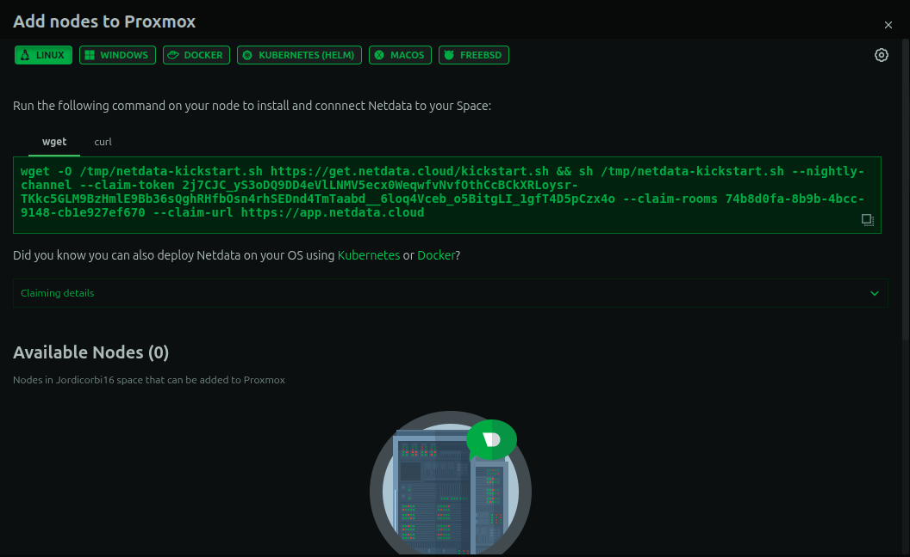
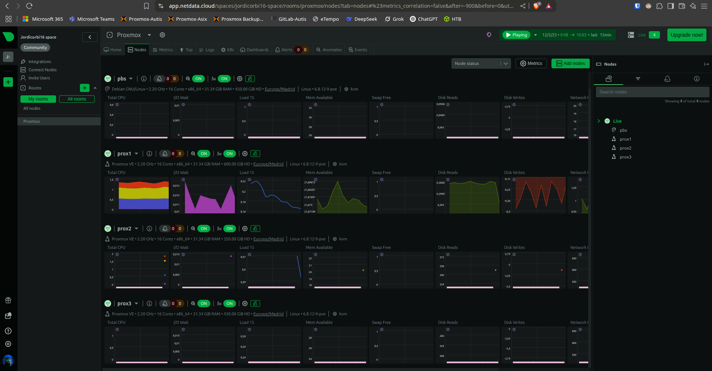

<a name="top"></a>
> Jordi Corbí Micó
> IES JAUME II EL JUST (Tavernes de la Valldiga) - Curs 2023/2025  
> Ciclo: CFGS Administració de Sistemes Informatics en Xarxa

# Projecte Final de Cicle Superior d'ASIR: Gestió Avançada de Proxmox

## 📌 Descripció

Aquest projecte consisteix en la implementació d'una infraestructura virtualitzada utilitzant Proxmox VE. L'objectiu principal és optimitzar la gestió de recursos i facilitar la implementació de serveis en un entorn controlat i escalable.

## 🧱 Estructura del projecte

```
Projecte_Proxmox/
└── README.md
│   └── documentació/
│       │ 
│       ├── instalació/
│       │    ├── proxmox/
│       │    │   ├──  README.md
│       │    │   └──  install.pdf
│       │    └── proxmox_backup/
│       │        ├──  README.md
│       │        └──  install.pdf
│       │
│       └── configuració/
│           ├── proxmox/
│           │   ├──  README.md
│           │   └──  conf.pdf
│           └── proxmox backup server/
│              ├──  README.md
│              └──  conf.pdf
├── img/
└──  README.md
```


## 📄 Contingut

- **Documentació/**: Conté la memòria del projecte i els annexos amb informació detallada sobre la implementació i configuració.
- **README.md**: Aquest fitxer, que proporciona una visió general del projecte.


## ⚙️ Requisits

- Proxmox VE 8.x
- Proxmox Backup Server 
- Maquinari compatible amb virtualització (Intel VT-x o AMD-V)
- Connexió a Internet per a la descàrrega de paquets i actualitzacions

---

## 📘 1. Introducció

### 🎯 1.1 Objectius del projecte

L’objectiu principal d’aquest projecte és dissenyar, implementar i documentar una infraestructura virtualitzada d’alta disponibilitat utilitzant Proxmox VE. L’entorn inclou emmagatzematge distribuït mitjançant Ceph i una solució centralitzada de còpies de seguretat amb Proxmox Backup Server (PBS). Tot això es realitza sobre un clúster compost per dos nodes físics que ofereixen serveis de virtualització, replicació i resiliència davant fallades.

### 🧩 1.2  de l’elecció de Proxmox VE

S’ha triat Proxmox VE per ser una plataforma de virtualització de codi obert que ofereix una solució completa i robusta per a la gestió de màquines virtuals i contenidors. Permet la creació de clústers, integra emmagatzematge distribuït amb Ceph, ofereix gestió de backups mitjançant PBS i dona suport a l’alta disponibilitat de manera nativa. A més, la seua interfície web intuïtiva facilita enormement les tasques administratives i de monitoratge, fins i tot per a usuaris amb coneixements mitjans.

### 🗺️ 1.3 Abast del projecte

Aquest projecte abasta des del disseny inicial fins a la implementació i documentació de tota la infraestructura. Inclou:

- Instal·lació de dos nodes amb Proxmox VE i configuració en clúster.
- Configuració i integració de Ceph com a sistema d’emmagatzematge distribuït.
- Implementació de Proxmox Backup Server per a còpies de seguretat automatitzades.
- Definició d’estratègies d’alta disponibilitat i recuperació davant fallades.
- Gestió d’usuaris i polítiques de seguretat.
- Redacció de guies tècniques per a l’administració i ús de l’entorn.

### 🧠 1.4 Requisits previs i coneixements necessaris

Per a dur a terme aquest projecte, es requereixen coneixements en:

- Sistemes operatius Linux (preferiblement Debian o derivats).
- Virtualització (KVM, contenidors LXC).
- Conceptes bàsics d’emmagatzematge distribuït i Ceph.
- Gestió d’usuaris i polítiques de seguretat.
- Ús de línia d’ordres i edició d’arxius de configuració en Linux.

---

Perfecte! A continuació et redacte completament la secció **2. Anàlisi i Disseny de la Infraestructura**, incloent els punts del 2.1 al 2.5, en valencià formal i tècnic, pensat per al teu projecte amb **Proxmox VE**:

---

## 🧱 2. Anàlisi i Disseny de la Infraestructura

L’objectiu d’aquesta secció és definir els requisits, la xarxa i el disseny tècnic necessari per al desplegament d’un clúster **Proxmox VE** amb alta disponibilitat i sistemes de còpia de seguretat centralitzada.

---

### ✅ 2.1 Requisits Funcionals i No Funcionals

#### **Requisits funcionals**

* El sistema ha de permetre la creació i gestió de màquines virtuals i contenidors (VM i LXC).
* Ha d’incloure un sistema d’emmagatzematge distribuït (Ceph).
* S’ha de poder realitzar còpies de seguretat automàtiques mitjançant Proxmox Backup Server.
* El clúster ha de suportar alta disponibilitat per a serveis crítics.
* S’ha de poder gestionar usuaris amb permisos delegats.

#### **Requisits no funcionals**

* La infraestructura ha de ser escalable per a afegir nous nodes o recursos.
* Ha de tindre tolerància a fallades sense pèrdua de dades.
* Ha d’oferir un rendiment acceptable amb maquinari limitat.
* El sistema ha de ser administrable mitjançant una interfície gràfica web intuïtiva.

---

### 🌐 2.2 Topologia de Xarxa Proposada

> En aquest entorn de pràctiques s’ha desplegat un únic servidor físic amb **Proxmox VE** com a hipervisor principal. Dins d’aquest servidor, s’han creat diverses màquines virtuals que simulen els diferents **nodes d’un clúster**, així com un servidor addicional amb **Proxmox Backup Server (PBS)**.
>
> Aquesta arquitectura permet **reproduir un escenari realista** amb alta disponibilitat, emmagatzematge distribuït (Ceph) i còpies de seguretat centralitzades, però en un entorn virtualitzat controlat i sense necessitat de diversos equips físics.

---

### 🖥️ Diagrama:

```plaintext
             ┌───────────────────────────────────────────────────────────────────────┐
             │         Servidor físic amb Proxmox VE                                 │
             │                                                                       │
             │   ┌────────────┐   ┌────────────┐   ┌────────────┐   ┌────────────┐   │
             │   │  Node 1 VM │ ←→│  Node 2 VM │ ←→│  Node 3 VM │   │   PBS VM   │   │
             │   └────────────┘   └────────────┘   └────────────┘   └────────────┘   │
             │                                                                       │
             └───────────────────────────────────────────────────────────────────────┘
```

🔧 *Tots els nodes i el PBS són màquines virtuals creades dins del mateix host Proxmox VE.*

---

### 🖥️ 2.3 Maquinari Utilitzat

#### **Nodes del clúster (x2):**

* **CPU:** 16 x Intel(R) Xeon(R) CPU E5-2696 v4 @ 2.20GHz 
* **RAM:** 32 GB DDR4
* **Disc SSD:** 1x 150 GB per a sistema
* **Discos HDD:** 2x 100 TB per a Ceph (OSD)

#### **Nodes del clúster 3:**

* **CPU:** 12 x Intel(R) Xeon(R) CPU E5-2696 v4 @ 2.20GHz 
* **RAM:** 24 GB DDR4
* **Disc SSD:** 1 x 150 GB per a sistema
* **Discos HDD:** 1 x 100 TB per a Ceph (OSD)

#### **Proxmox Backup Server:**

* **CPU:** 16 x Intel(R) Xeon(R) CPU E5-2696 v4 @ 2.20GHz 
* **RAM:** 32 GB
* **Disc SSD:** 1 x 150 GB per al sistema
* **HDD:** 3 x 100 GB RAID1 (datastore de còpies)

---

### 🧩 2.4 Disseny Lògic del Clúster Proxmox

* El clúster estarà format per **3 nodes** Proxmox VE amb **Ceph integrat** com a sistema d’emmagatzematge.
* Cada node tindrà assignat el rol de **MON, MGR i OSD**.
* Es crearà un **pool Ceph RBD** per allotjar màquines virtuals i contenidors.
* Es configurarà **alta disponibilitat (HA)** per a màquines crítiques.
* La gestió es centralitzarà mitjançant **Proxmox VE GUI**.

---

### 🛡️ 2.5 Consideracions d’Alta Disponibilitat i Tolerància a Fallades

* El sistema utilitzarà **Corosync** per a la comunicació entre nodes i manteniment del **quorum**.
* Ceph garantirà replicació de dades entre els OSDs per evitar pèrdua d’informació.
* El **mòdul HA de Proxmox** gestionarà automàticament el failover de màquines virtuals.
* L’estructura amb 3 nodes assegura que, si un node falla, els altres dos mantenen el clúster operatiu.
* El **Proxmox Backup Server** es manté fora del clúster per garantir recuperació en cas de fallida total.

---

## 🧠 10. Conclusions i Valoració Personal

### 10.1 Objectius aconseguits

### 10.2 Dificultats trobades i solucions

⚠️ Problema amb els repositoris de **Proxmox Backup Server**
Una de les principals dificultats trobades ha sigut l’actualització dels paquets del sistema, ja que per defecte, Proxmox Backup Server ve configurat amb els repositoris enterprise, els quals requereixen una subscripció de pagament.

✅ ***Solució tècnica:*** utilitzar repositoris públics
Per tal de poder actualitzar i instal·lar paquets sense necessitat de subscripció, es pot configurar el sistema per a fer ús dels repositoris públics (no enterprise) de **Proxmox.**


### **8.1. Actualización y parches de seguridad**
✅ **Acciones recomendadas:**
- **Actualizar regularmente**:
  ```bash
  apt update && apt dist-upgrade
  ```
- Habilitar **actualizaciones automáticas de seguridad**:
  ```bash
  apt install unattended-upgrades
  dpkg-reconfigure unattended-upgrades
  ```
- Verificar parches de Proxmox:
  ```bash
  pveam update
  ```

---

### **8.2. Configuración de firewall en Proxmox**
✅ **Acciones recomendadas:**
- Activar el **firewall integrado** en Proxmox (GUI: `Datacenter > Firewall`).
- Reglas básicas:
  - Permitir solo SSH (puerto 22), Proxmox Web (8006) y Ceph (si se usa) desde IPs confiables.
  - Bloquear accesos externos a APIs no necesarias.
- Ejemplo para permitir acceso web desde una IP específica:
  ```bash
  pve-firewall localnet add -enable 1 -policy in -action ACCEPT -dport 8006 -source 192.168.1.100
  ```

---

### **8.3. Copias de seguridad de la configuración**
✅ **Acciones recomendadas:**
- **Backup de la configuración del clúster**:
  ```bash
  tar -czvf /backup/proxmox_config_$(date +%Y-%m-%d).tar.gz /etc/pve/
  ```
- **Automatizar backups** con PBS:
  - Programar backups diarios/semanales de VMs/LXCs (GUI: `PBS > Datastore > Backup Jobs`).
  - Usar **retención incremental** (ejemplo: 7 días diarios + 4 semanales).

---

### **8.4. Buenas prácticas de administración**
✅ **Acciones recomendadas:**
- **Usar autenticación de dos factores (2FA)** para la GUI de Proxmox (GUI: `Datacenter > Permissions > Users`).
- **Restringir acceso SSH**:
  ```bash
  nano /etc/ssh/sshd_config
  ```
  - Añadir: `PermitRootLogin no`, `PasswordAuthentication no` (usar claves SSH).
- **Monitoreo**:
  - Configurar alertas por email (GUI: `Datacenter > Notifications`).
  - Usar `ceph health` y `pveperf` para vigilar rendimiento.

Perfecte! A continuació et redacte l’apartat amb una explicació clara i formal sobre què és **Netdata**, i com l’utilitzareu **en mode núvol**, instal·lant només l’**agent** als nodes de Proxmox per monitoritzar-los centralitzadament:

---

### 8.5 Monitorització del sistema amb **Netdata**

#### 🧠 Què és Netdata?

**Netdata** és una plataforma de monitorització en temps real que permet supervisar el rendiment i l’estat de sistemes i serveis de manera molt detallada. És una eina **lleugera**, de **codi obert** i fàcil d’integrar en entorns Linux, incloent **Proxmox VE**.

Proporciona dades sobre:

* Ús de CPU, RAM i disc
* Tràfic i estat de la xarxa
* Estadístiques de processos
* Temperatura, serveis actius, ports, etc.

---

### ☁️ Utilització de **Netdata Cloud** al projecte

En lloc de desplegar una instància de monitorització local o en cada node, en aquest projecte s’utilitzarà la **plataforma centralitzada de Netdata Cloud**.

Aquesta estratègia es basa en instal·lar únicament l’**agent de Netdata** a cada node que es vulga monitoritzar, i connectar-lo al panell de control global de Netdata Cloud.

#### ✅ Avantatges de fer servir el núvol:

* 🔒 **Alta disponibilitat:** La plataforma està disponible 24/7 des de qualsevol lloc
* 🌐 **Accessibilitat centralitzada:** Tots els nodes es poden supervisar des d’un únic panell
* 📈 **Visualització interactiva:** Gràfics en temps real i alertes integrades
* 🧩 **Zero manteniment de servidors de monitoratge locals**
* 🔔 Possibilitat de configurar notificacions (Slack, correu, Discord...)

---

### 🛠️ Procediment bàsic

1. Crear un compte gratuït en [https://app.netdata.cloud](https://app.netdata.cloud)
2. En cada node que es vulga monitoritzar:

   * Instal·lar l’agent amb:

     ```bash
      wget -O /tmp/netdata-kickstart.sh https://get.netdata.cloud/kickstart.sh && sh /tmp/netdata-kickstart.sh --nightly-channel --claim-token 2j7CJC_yS3oDQ9DD4eVlLNMV5ecx0WeqwfvNvfOthCcBCkXRLoysr-TKkc5GLM9BzHmlE9Bb36sQghRHfbOsn4rhSEDnd4TmTaabd__6loq4Vceb_o5BitgLI_1gfT4D5pCzx4o --claim-rooms 6ff6ecc7-275c-4404-a4a0-5fac76e79776 --claim-url https://app.netdata.cloud
     ```

     

   * Connectar l’agent al compte de Netdata Cloud amb la comanda que proporciona el portal (normalment `netdata-claim.sh`)
3. Accedir al panell de **Netdata Cloud** i visualitzar tots els nodes en temps real



---

### ✅ Resultat

Amb aquest sistema, es garanteix una **monitorització eficaç i des de qualsevol lloc**, sense haver de desplegar ni mantindre servidors propis per a l’anàlisi. Netdata Cloud facilita una supervisió **proactiva i àgil** del clúster Proxmox i del Proxmox Backup Server (PBS).

---

### 🚀 10.3 Possibles millores futures

#### **1. Docker com a Complement a LXC**  
📌 *Millora la flexibilitat i portabilitat dels contenidors*  
- **Objectiu**: Integrar Docker dins de VMs/containers per aprofitar:  
  - 🐋 Ecosistema més ampli d'imatges preconfigurades  
  - 🔄 Compatibilitat amb Kubernetes i eines CI/CD  
  - 🛠️ Plantilles predefinides amb Docker + Portainer  
- **Reptes**:  
  - Configurar *systemd* en LXC existents  
  - Establir polítiques de seguretat específiques  

---

#### **2. Seguretat Avançada**  
🔐 *Hardening del cluster i xifrat de dades*  
- **Certificats TLS personalitzats**:  
  ```bash  
  pvecm updatecerts -force  # Actualitza certificats autofirmats  
  ```  
- **Xifrat de discs amb LUKS** (per a PBS/Ceph):  
  ```bash  
  cryptsetup luksFormat /dev/sdX  # Xifrat en repòs  
  ```  
- **Integració amb LDAP/AD** per a gestió centralitzada d’usuaris.  
- 
---

#### **3. Xarxa i Aïllament**  
🌐 *Segmentació per a major seguretat*  
- **VLANs dedicades**:  
  ```  
  auto vmbr0.100  
  iface vmbr0.100 inet static  
      address 192.168.100.2/24  
      vlan-raw-device vmbr0  
  ```  
  - Separar trànsit de gestió, Ceph i VMs.  

---

### **📋 Resum de Prioritats**  
| **Àrea**          | **Acció Clau**                          | **Benefici Principal**                |  
|--------------------|----------------------------------------|---------------------------------------|  
| **Contenidors**    | Integració Docker + Portainer          | Portabilitat i ecosistema ampliat     |  
| **Seguretat**      | Hardening + LUKS + LDAP                | Protecció de dades i accés controlat  |  
| **Xarxa**          | VLANs Dedicades                        | Segmentació per a major seguretat     |  

---

### 🎯 10.4 Valoració tècnica i personal del projecte

Aquestes millores convertiran el nostre entorn en un sistema **més robust, segur i fàcil de gestionar**, adaptant-se tant a entorns educatius com empresarials.  

### Valoració personal del projecte

Aquest projecte m’ha permés consolidar coneixements adquirits durant el cicle formatiu, especialment en àrees com la virtualització, l’alta disponibilitat i la gestió d’infraestructures TI. A través de la implementació pràctica amb **Proxmox VE**, he pogut entendre millor el funcionament dels clústers, l’emmagatzematge distribuït amb **Ceph** i la importància de les còpies de seguretat amb **PBS**.

A nivell acadèmic, ha sigut una experiència molt completa, ja que m’ha ajudat a connectar la teoria amb la pràctica, millorant la meua capacitat d’anàlisi, resolució de problemes i documentació tècnica. Considere que ha sigut un projecte molt útil per a preparar-me de cara a entorns reals i futurs reptes professionals en el sector de les tecnologies de la informació.

---

## 📎 11. Annexos

## 11.1 Bibliografia

A continuació es detallen les fonts utilitzades per al desenvolupament del projecte:

1. Proxmox. *Documentació oficial de Proxmox VE*. Accés 29 d’abril de 2025. [ Proxmox ](https://pve.proxmox.com/wiki/Main_Page).
2. Debian Project. *Debian Wiki*. Accés 25 d’abril de 2025. [Debian](https://wiki.debian.org/).
3. GitHub. *Repo*. Accés de seguit.[ Projecte Proxmox ](https://github.com/jcorbii/Projecte_Proxmox/)
4. Netdata  *Instalació Netdata*. Accés 12 de maig de 2025. [Netdata](https://www.netdata.cloud/)