# 6. 💾 Proxmox Backup Server (PBS)

## 📂 6.2 Creació del Datastore en Proxmox Backup Server

### 🛑 **Requisits previs**

> ⚠️ Tots els discos seran esborrats. Assegura’t que **no continguen dades importants** abans de continuar.

---

### 🔧 1. Verificar instal·lació de ZFS

🔧  Instalar ZFS (si encara no está instalat)

```bash
apt update
apt install zfsutils-linux -y
```


Això confirma que el sistema està preparat per a treballar amb pools ZFS.

---

### 🗂️ 2. Creació del ZFS pool

Existien tres opcions principals per a crear el pool ZFS, depenent del nombre de discos disponibles i les necessitats d’emmagatzematge i redundància:

* **Opció A**: `striped` – màxim espai però sense cap tolerància a fallades.
* **Opció B**: `mirror` – redundància completa però requereix un nombre parell de discos.
* **Opció C**: `raidz` – una combinació equilibrada entre espai disponible i tolerància a falles (similar a RAID 5).

👉 **Atés que en aquesta màquina només disposem de tres discos** (`/dev/vda`, `/dev/vdb` i `/dev/vdc`), la millor opció des del punt de vista tècnic és **RAIDZ**, ja que ens ofereix una bona capacitat d’emmagatzematge i alhora permet resistir la fallada d’un disc sense perdre les dades.


Per crear el pool:

```bash
zpool create backup-pool raidz /dev/vda /dev/vdb /dev/vdc
```


---

### ✅ 3. Verificar l’estat del pool

Després de la creació, podem comprovar que el pool funciona correctament:

```bash
zpool status
```


Hauries de veure un estat **ONLINE** i el pool anomenat `backup-pool`.

---

### 🗃️ 4. Crear el datastore en PBS

A través de la interfície web de PBS:

1. Anar a **Datastore > Create**
2. Omplir els camps:

   * **ID**: `zfs-backup`
   * **Path**: `/backup-pool` (punt de muntatge automàtic creat per ZFS)
3. Fer clic a **Create**

- Creació del **Datastore**


---

### 🔄 5. Comprovació i muntatge automàtic

ZFS gestiona automàticament el muntatge del pool. Per comprovar-ho:

```bash
zfs list
```

Resultat esperat:

```
NAME           USED  AVAIL  REFER  MOUNTPOINT
backup-pool    96K   900G    96K   /backup-pool
```


A partir d’aquest moment, el sistema ja pot utilitzar el datastore per a còpies de seguretat, amb les garanties que ofereix ZFS quant a integritat de dades i rendiment.

Perfecte! Ací tens la redacció millorada en **valencià formal**, amb **iconografia** i amb les **faltes corregides**, mantenint el format Markdown:

---

## 💾 6.3 Integració amb Proxmox VE

Per integrar el **Proxmox Backup Server (PBS)** com a sistema d’emmagatzematge dins del clúster de **Proxmox VE**, cal seguir els passos següents:

---

### 🔐 1. Copiar l’**Empremta digital (Fingerprint)** del PBS

Accedeix al **Proxmox Backup Server** i ves a:

📍 `Dashboard → Show Fingerprint`

Esta empremta és necessària per establir una connexió segura entre els nodes de Proxmox VE i el servidor PBS.

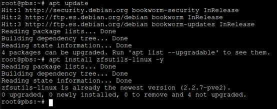

---

### ➕ 2. Afegir l’Almacenament al Clúster de Proxmox

Una vegada copiada l’empremta, accedim a qualsevol node del clúster de **Proxmox VE** i seguim els passos següents:

1. Ves a **Datacenter → Storage**
2. Fes clic a **Add** i selecciona l’opció **Proxmox Backup Server**

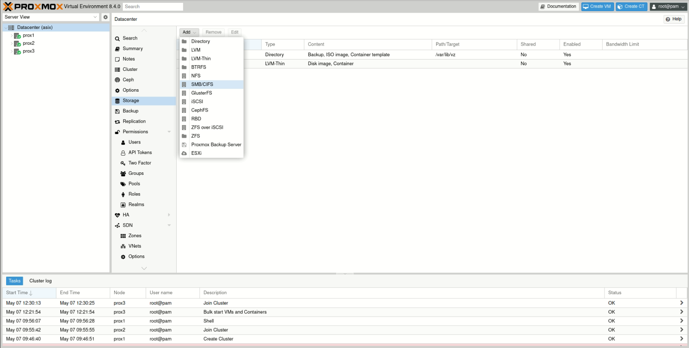

---

### 📝 3. Omplir les Dades de Connexió

Ara introduïm la informació requerida del servidor PBS:

<p align="center">
  
</p>

* **ID:** Nom identificador per a l’almacenament
* **Server:** IP o domini del servidor PBS
* **Username:** Nom d’usuari per connectar-se
* **Password:** Contrasenya corresponent
* **Nodes:** Nodes del clúster que tindran accés a l’almacenament
* **Datastore:** Nom del repositori, per exemple `zfs-backups`
* **Namespace:** Espai de noms (opcional, si s’utilitzen subespais dins el datastore)

---

### ✅ 4. Confirmar i Finalitzar

Una vegada configurat, el sistema validarà les dades i l’almacenament PBS apareixerà com a disponible per a fer còpies de seguretat o restauracions.


---

🔚 **Amb aquests passos, ja tens el teu Proxmox Backup Server integrat dins del clúster de Proxmox VE.** Això et permet gestionar còpies de seguretat de forma centralitzada, eficient i segura.

Clar! Ací tens la redacció **revisada, tècnica i formal** en valencià, amb correccions gramaticals i millor estructuració del contingut. Mantinc les imatges i el format Markdown:

---

## 💡 6.4 Programació de Còpies de Seguretat i Creació de Màquines Virtuals i Contenidors

En aquest entorn, treballarem tant amb **contenidors (LXC)** com amb **màquines virtuals (KVM)**. Per a gestionar correctament les còpies de seguretat i automatitzar-les, primer hem de tindre clar com es creen els recursos que es volen protegir.

---

### 📦 Descàrrega de plantilles per a Contenidors (CT)

Per a poder crear un contenidor, és necessari **disposar d’un *template*** (plantilla) corresponent al sistema operatiu desitjat.

1. Ves a la secció de **Storage** (almacenament)
2. Selecciona l’opció **Templates**
3. Tens diverses maneres d’obtindre una plantilla:

   * 📤 **Pujar-la manualment** (upload)
   * 🔗 **Descarregar-la des d’una URL externa**
   * 📥 **Utilitzar les plantilles predefinides** que ofereix Proxmox

📌 En el nostre cas, utilitzarem la tercera opció: **plantilles predefinides**

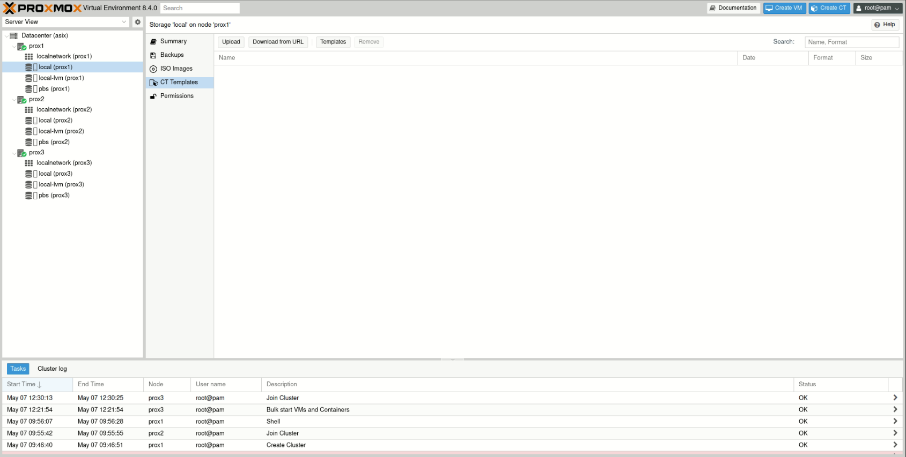

Per a aquest projecte, descarregarem i utilitzarem plantilles de:

* **Debian**
* **Fedora**

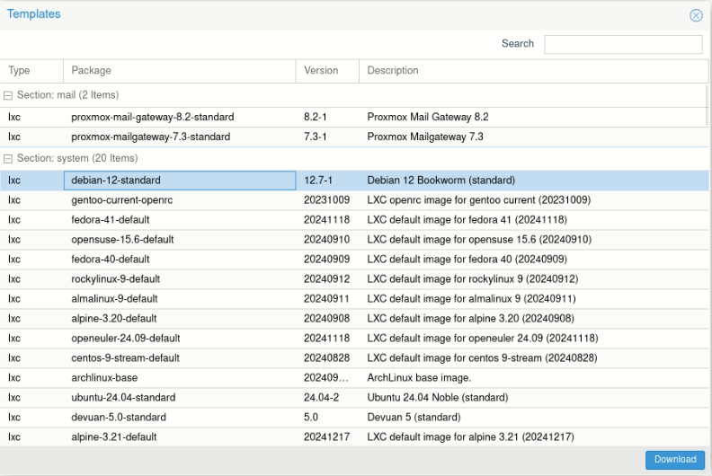

---

### 📁 Preparació per a crear una Màquina Virtual (VM)

Per a crear una màquina virtual, és necessari **pujar una ISO** del sistema operatiu al nostre *storage*. Aquesta ISO s’ubica dins de la categoria de **"ISO Images"**.

1. Ves a `Datacenter → Storage`
2. Selecciona el teu emmagatzematge
3. Fes clic a **Upload**
4. Pujar la imatge ISO corresponent (ex. Debian, Ubuntu, Windows...)

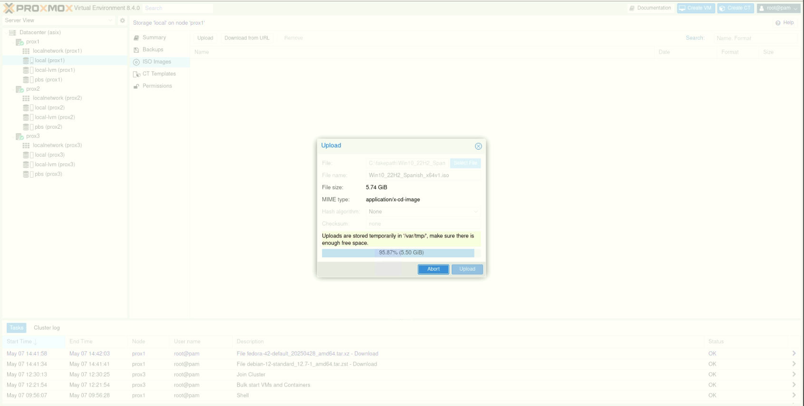

---

## 🧱 Creació d’un Contenidor (CT)

Un cop tenim el *template* descarregat, podem crear un contenidor amb els passos següents:

### 🧭 Pas 1: Inici de la creació

1. Fes clic a **Create CT** (Crear CT)
   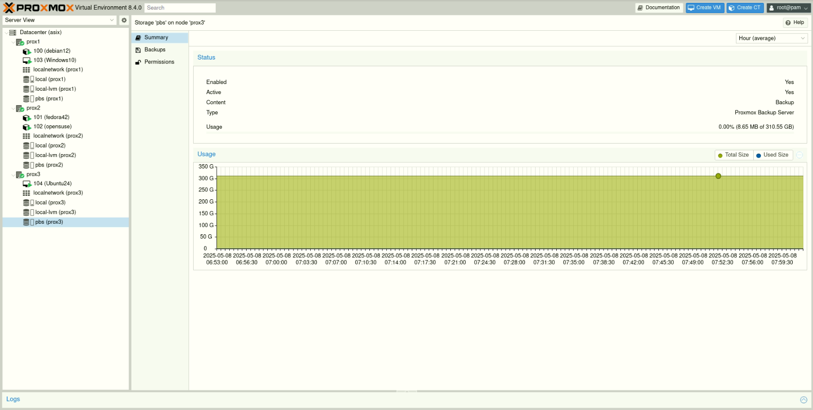

---

### 📝 Pas 2: Informació bàsica

Introdueix les dades del contenidor:

* **Node:** on es desplegarà
* **CT ID:** identificador únic
* **Hostname:** nom del sistema
* **Resource Pool:** (opcional) agrupació de recursos
* **Password:** per a l’accés del root

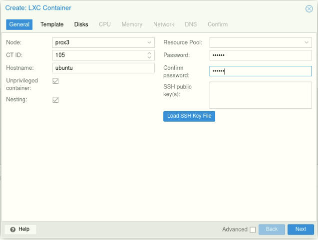

---

### 📦 Pas 3: Selecció del *Template*

Selecciona la plantilla que has descarregat anteriorment.

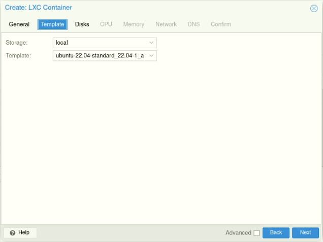

---

### 💽 Pas 4: Emmagatzematge

Indica quin **storage** utilitzarà el contenidor.

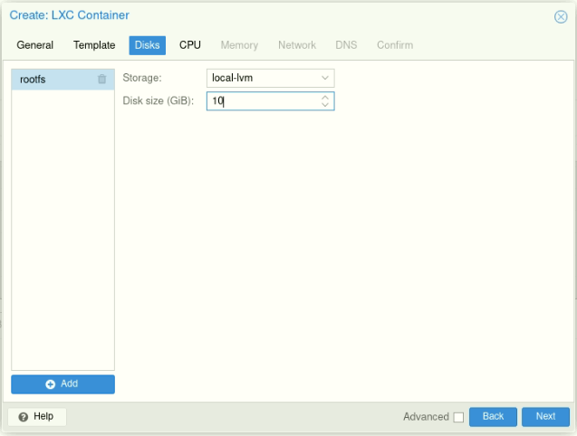

---

### 🧮 Pas 5: Configuració de recursos

* **CPU:** nombre de nuclis assignats
  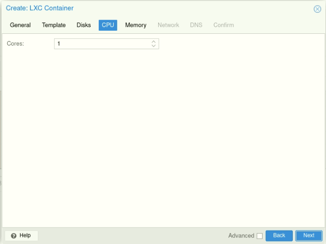

* **RAM:** memòria en MB
  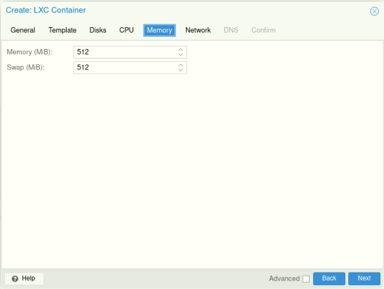

---

### 🌐 Pas 6: Xarxa

Defineix la configuració de xarxa (bridge, IP, VLAN, etc.)

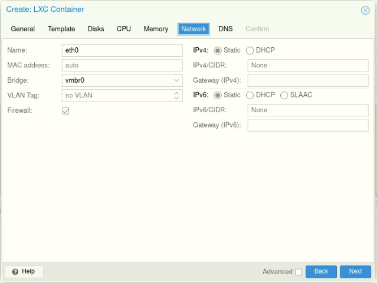

---

### ✅ Finalització

Un cop completats tots els passos, el contenidor serà creat i apareixerà a la llista de recursos del node.

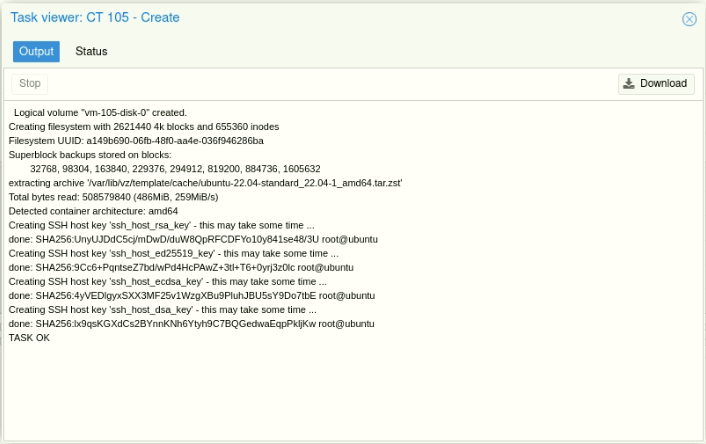

---

## 🖥️ Creació d’una Màquina Virtual (VM)

Els passos per crear una màquina virtual són **molt similars** als del contenidor, amb l’única diferència que:

* Es selecciona una **ISO** en lloc d’un *template*
* Es configura un **disc virtual** (en format qcow2, raw o ZFS)
* Es defineixen opcions d’instal·lació del sistema operatiu (com si fos una màquina física)

---

🔁 Un cop creats els contenidors i les màquines virtuals, ja es poden **programar còpies de seguretat regulars** mitjançant **Proxmox Backup Server (PBS)** o les eines integrades en Proxmox VE.

Perfecte! A continuació tens el punt **6.4 Restauració de màquines virtuals i contenidors** redactat en valencià formal i tècnic, mantenint la coherència amb l’estructura del teu projecte:

Clar! Ací tens el punt **6.4 Programació de Còpies de Seguretat** (nota: l’has tornat a enumerar com 6.4, però com que ja s’ha usat aquest número, aquest seria realment el **6.5**, a menys que vulgues reorganitzar). Et deixe el contingut redactat tècnicament i en valencià formal:

---

### 🔄  Programació de Còpies de Seguretat

Una correcta **estratègia de programació de còpies de seguretat** és essencial per a garantir la disponibilitat i recuperació de dades en entorns de producció. Amb **Proxmox VE** i la integració amb **Proxmox Backup Server (PBS)**, es pot automatitzar aquest procés de forma eficient.

---

### 🗓️ Planificació de les còpies

La planificació ha de tindre en compte:

* **Freqüència de còpia:** diària, setmanal o mensual segons la criticitat del sistema
* **Hora d’execució:** preferentment fora de l’horari productiu per minimitzar impacte
* **Recursos inclosos:** contenidors, màquines virtuals o pools de recursos
* **Duració esperada:** basada en la mida i nombre de sistemes a protegir

---

### 🧠 Bones pràctiques de planificació

* 🧩 **Dividir per grups de càrrega:** programar còpies per pools o per tipus de màquines
* 🕐 **Evitar solapaments:** distribuint les tasques durant la nit o cap de setmana
* 🧪 **Fer proves de restauració regulars** per validar les còpies

---

### 🔐 Integració amb polítiques de retenció

La programació de còpies de seguretat ha d’anar acompanyada d’una política de **retenció** que mantinga un nombre raonable de còpies antigues per evitar saturació de l’emmagatzematge:

* **Retenció curta:** 7 còpies diàries
* **Retenció mitjana:** 4 setmanals
* **Retenció llarga:** 6 còpies mensuals

Aquesta política es pot aplicar automàticament des de la configuració del **storage** PBS a `Datacenter → Storage → pbs → Backup Retention `.

<p align="center">
  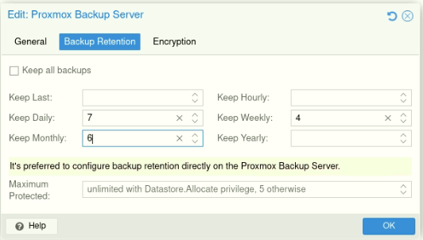
</p>

---

### ⚙️ Automatització des de Proxmox VE

Les tasques de còpia es poden programar fàcilment:

1. `Datacenter → Backup → Add`
2. Selecciona:

   * **Storage (PBS)**
   * **Calendari (cron):** ex. `0 21 * * *` per fer-la a les 21:00h cada dia
   * **Mode:** snapshot, suspend o stop
   * **Recursos:** tots, per pool o per ID

<p align="center">
  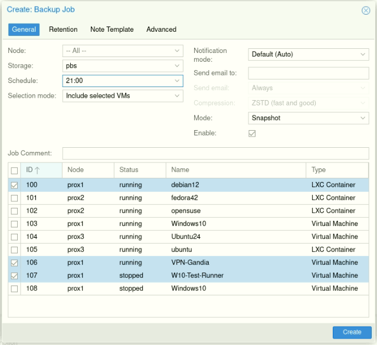
</p>

---

### ✅ Resultat

Amb una programació adequada i una estratègia de retenció ben definida, s'assegura la **protecció contínua de les dades** i es redueix el risc de pèrdua d'informació crítica, mantenint a la vegada l'emmagatzematge net i eficient.

---

### ♻️ 6.5 Restauració de Màquines Virtuals i Contenidors

Una de les funcionalitats més potents del **Proxmox Backup Server (PBS)** és la possibilitat de restaurar còpies de seguretat de manera ràpida i fiable, tant de **màquines virtuals (KVM)** com de **contenidors (LXC)**.

---

### 🔁 Tipus de restauració

Proxmox permet dues modalitats principals de restauració:

* **Restauració completa:** es crea una nova instància basada en la còpia de seguretat
* **Restauració in situ:** reemplaça una màquina existent per una còpia anterior (amb precaució)

---

### 🛠️ Procediment de restauració

#### 1. Accedir al la backup

* Entra a la interfície web del **Proxmox **
* Ves a `Datacenter → Storage → pbs`
* Selecciona la còpia de seguretat desitjada

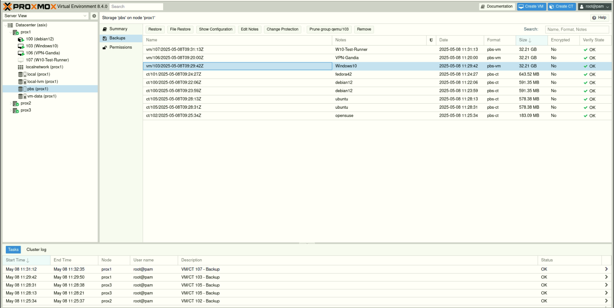

#### 2. Llençar la restauració

* Fes clic a **Restore**
* Defineix els paràmetres següents:

  * **Target Node:** node de Proxmox on es restaurarà la màquina
  * **VM ID nou:** (opcional) si vols crear una nova màquina amb un altre ID
  * **Mode de restauració:**

    * **Live restore (per a VMs):** restauració mentre la màquina torna a estar en funcionament (recomanat per a entorns amb poca tolerància a caigudes)
  * **Storage:** tria l’emmagatzematge de destí

<p align="center">
  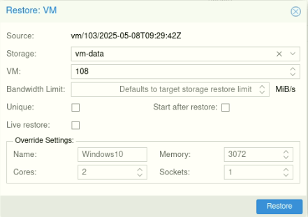
</p>

#### 3. Confirmar i monitorar

* Fes clic a **Restore**
* Segueix el procés mitjançant el registre de tasques
* Quan acabe, comprova que la màquina funciona correctament

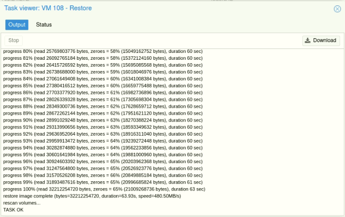

---

### 💡 Consells pràctics

* ✅ Fes proves de restauració periòdiques per assegurar que les còpies són vàlides
* ✅ Assigna nous ID o noms per evitar conflictes amb màquines existents
* ⚠️ Evita restaurar sobre una màquina activa si no és estrictament necessari

---

### ✅ Resultat

Amb aquest procediment, pots restaurar màquines virtuals i contenidors des del **PBS** amb alta flexibilitat i mínima interrupció del servei, millorant així la continuïtat i seguretat de la infraestructura virtualitzada.

Perfecte! Ací tens el punt **6.6 Estratègia de retenció i rotació de backups**, redactat de manera formal, tècnica i en valencià, seguint la línia del teu projecte:

---

### ♻️ 6.6 Estratègia de Retenció i Rotació de Backups

Una gestió adequada de la **retenció i rotació de còpies de seguretat** és fonamental per a garantir un ús eficient de l’emmagatzematge, així com per assegurar la disponibilitat de punts de restauració recents i rellevants.

---

### 🎯 Objectius de la retenció

* Mantindre còpies suficients per cobrir escenaris de recuperació (errors recents, corrupció, ciberatacs...)
* Evitar la saturació del sistema d’emmagatzematge
* Automatitzar l’eliminació de còpies antigues innecessàries

---

### 🛠️ Configuració de la política de retenció

En **Proxmox Backup Server (PBS)** es poden definir regles específiques per a cada tasca de backup, o de manera global per a cada **datastore**.

#### 📍 Localització:

* `Datacenter → Storage → pbs → Backup Retention

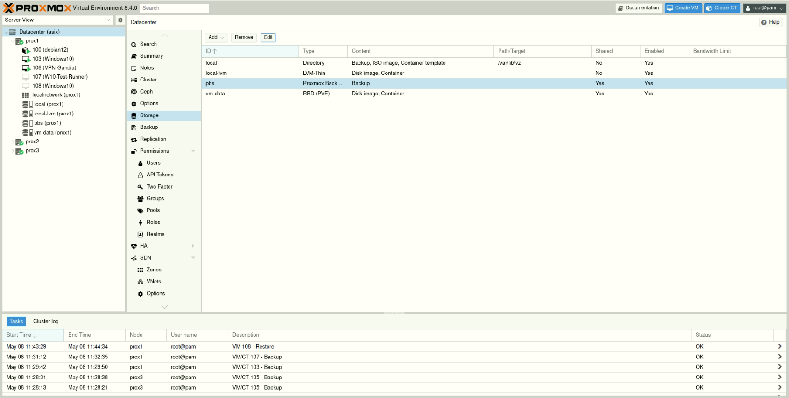

<p align="center">
  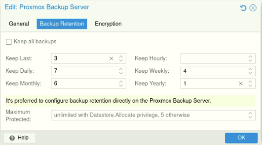
</p>

#### 📝 Paràmetres comuns:

| Paràmetre      | Descripció                                 | Exemple |
| -------------- | ------------------------------------------ | ------- |
| `keep-last`    | Nombre d'últimes còpies que es conservaran | 3       |
| `keep-daily`   | Nombre de còpies diàries                   | 7       |
| `keep-weekly`  | Còpies setmanals a mantindre               | 4       |
| `keep-monthly` | Còpies mensuals                            | 6       |
| `keep-yearly`  | Còpies anuals (opcional)                   | 1       |

Aquestes polítiques poden combinar-se per cobrir tant recuperacions recents com arxius històrics.

---

### 🔄 Procés de rotació

1. Quan s'executa una nova còpia de seguretat, **PBS comprova si s'excedeixen els límits configurats**
2. Si és així, **pruna (elimina)** les còpies més antigues segons la política definida
3. Aquest procés és **automàtic** i es registra en els **logs** del sistema

---

### 💡 Recomanacions

* 🧮 Defineix polítiques diferents segons la criticitat de cada màquina o servei
* 🗓️ Combina còpies **diàries** amb còpies **mensuals de llarg termini**
* 🧪 Revisa periòdicament l’estat dels datastores i els **logs de prunes**

---

### ✅ Resultat

Amb una estratègia de retenció ben definida, el sistema manté un equilibri entre **disponibilitat de dades** i **optimització de recursos**, evitant tant la pèrdua d’informació com la sobrecàrrega del sistema d’emmagatzematge.


---

### **8.1. Actualización y parches de seguridad**
✅ **Acciones recomendadas:**
- **Actualizar regularmente**:
  ```bash
  apt update && apt dist-upgrade
  ```
- Habilitar **actualizaciones automáticas de seguridad**:
  ```bash
  apt install unattended-upgrades
  dpkg-reconfigure unattended-upgrades
  ```
- Verificar parches de Proxmox:
  ```bash
  pveam update
  ```

---

### **8.2. Configuración de firewall en Proxmox**
✅ **Acciones recomendadas:**
- Activar el **firewall integrado** en Proxmox (GUI: `Datacenter > Firewall`).
- Reglas básicas:
  - Permitir solo SSH (puerto 22), Proxmox Web (8006) y Ceph (si se usa) desde IPs confiables.
  - Bloquear accesos externos a APIs no necesarias.
- Ejemplo para permitir acceso web desde una IP específica:
  ```bash
  pve-firewall localnet add -enable 1 -policy in -action ACCEPT -dport 8006 -source 192.168.1.100
  ```

---

### **8.3. Copias de seguridad de la configuración**
✅ **Acciones recomendadas:**
- **Backup de la configuración del clúster**:
  ```bash
  tar -czvf /backup/proxmox_config_$(date +%Y-%m-%d).tar.gz /etc/pve/
  ```
- **Automatizar backups** con PBS:
  - Programar backups diarios/semanales de VMs/LXCs (GUI: `PBS > Datastore > Backup Jobs`).
  - Usar **retención incremental** (ejemplo: 7 días diarios + 4 semanales).

---

### **8.4. Buenas prácticas de administración**
✅ **Acciones recomendadas:**
- **Usar autenticación de dos factores (2FA)** para la GUI de Proxmox (GUI: `Datacenter > Permissions > Users`).
- **Restringir acceso SSH**:
  ```bash
  nano /etc/ssh/sshd_config
  ```
  - Añadir: `PermitRootLogin no`, `PasswordAuthentication no` (usar claves SSH).
- **Monitoreo**:
  - Configurar alertas por email (GUI: `Datacenter > Notifications`).
  - Usar `ceph health` y `pveperf` para vigilar rendimiento.


---