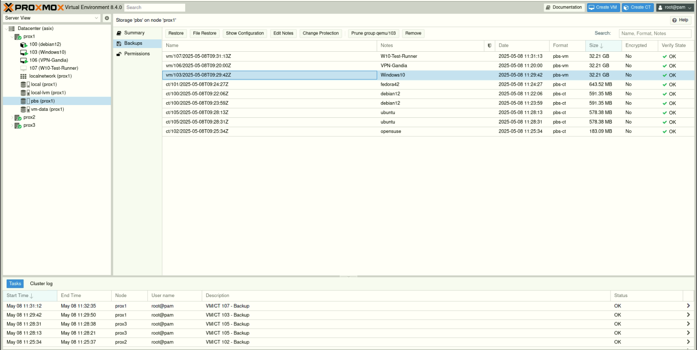

\section*{6. \emoji{floppy-disk} Proxmox Backup Server (\textbf{PBS})}
\begin{itemize}
  \item 6.1 Instal·lació de PBS  
  \item 6.2 Creació del Datastore
  \item 6.3 Integració amb Proxmox VE  
  \item 6.4 Programació de còpies de seguretat  
  \item 6.5 Restauració de màquines virtuals  
  \item 6.6 Estratègia de retenció i rotació de backups  
\end{itemize}

\newpage

# 6. \emoji{floppy-disk} Proxmox Backup Server (PBS)

## \emoji{open-file-folder} 6.2 Creació del Datastore en Proxmox Backup Server

### \emoji{stop-sign} **Requisits previs**

> \emoji{warning} Tots els discos seran esborrats. Assegura’t que **no continguen dades importants** abans de continuar.

### \emoji{wrench} 1. Verificar instal·lació de ZFS

\emoji{wrench}  Instalar ZFS (si encara no está instalat)

```bash
apt update
apt install zfsutils-linux -y
```

\begin{center}
    \includegraphics[width=0.6\textwidth]{../../../img/image-22.png}
\end{center}

Això confirma que el sistema està preparat per a treballar amb pools ZFS.

### \emoji{card-index-dividers} 2. Creació del ZFS pool

Existien tres opcions principals per a crear el pool ZFS, depenent del nombre de discos disponibles i les necessitats d’emmagatzematge i redundància:

* **Opció A**: `striped` – màxim espai però sense cap tolerància a fallades.
* **Opció B**: `mirror` – redundància completa però requereix un nombre parell de discos.
* **Opció C**: `raidz` – una combinació equilibrada entre espai disponible i tolerància a falles (similar a RAID 5).

\emoji{backhand-index-pointing-right} **Atés que en aquesta màquina només disposem de tres discos** (`/dev/vda`, `/dev/vdb` i `/dev/vdc`), la millor opció des del punt de vista tècnic és **RAIDZ**, ja que ens ofereix una bona capacitat d’emmagatzematge i alhora permet resistir la fallada d’un disc sense perdre les dades.

\begin{center}
    \includegraphics[width=0.6\textwidth]{../../../img/image-23.png}
\end{center}

Per crear el pool:

```bash
zpool create backup-pool raidz /dev/vda /dev/vdb /dev/vdc
```

\begin{center}
    \includegraphics[width=0.6\textwidth]{../../../img/image-24.png}
\end{center}

### 3. Verificar l’estat del pool

Després de la creació, podem comprovar que el pool funciona correctament:

```bash
zpool status
```

\begin{center}
    \includegraphics[width=0.6\textwidth]{../../../img/image-25.png}
\end{center}

Hauries de veure un estat **ONLINE** i el pool anomenat `backup-pool`.

### \emoji{card-file-box} 4. Crear el datastore en PBS

A través de la interfície web de PBS:

1. Anar a **Datastore > Create**
2. Omplir els camps:

   * **ID**: `zfs-backup`
   * **Path**: `/backup-pool` (punt de muntatge automàtic creat per ZFS)

3. Fer clic a **Create**

- Creació del **Datastore**

\begin{center}
    \includegraphics[width=0.6\textwidth]{../../../img/image-26.png}
\end{center}

\begin{center}
    \includegraphics[width=0.6\textwidth]{../../../img/image-27.png}
\end{center}

### \emoji{counterclockwise-arrows-button} 5. Comprovació i muntatge automàtic

ZFS gestiona automàticament el muntatge del pool. Per comprovar-ho:

```bash
zfs list
```

Resultat esperat:

```
NAME           USED  AVAIL  REFER  MOUNTPOINT
backup-pool    96K   900G    96K   /backup-pool
```

\begin{center}
    \includegraphics[width=0.6\textwidth]{../../../img/image-28.png}
\end{center}

A partir d’aquest moment, el sistema ja pot utilitzar el datastore per a còpies de seguretat, amb les garanties que ofereix ZFS quant a integritat de dades i rendiment.

## \emoji{floppy-disk} 6.3 Integració amb Proxmox VE

Per integrar el **Proxmox Backup Server (PBS)** com a sistema d’emmagatzematge dins del clúster de **Proxmox VE**, cal seguir els passos següents:

### \emoji{locked-with-key} 1. Copiar l’**Empremta digital (Fingerprint)** del PBS

Accedeix al **Proxmox Backup Server** i ves a:

\emoji{round-pushpin} `Dashboard → Show Fingerprint`

Esta empremta és necessària per establir una connexió segura entre els nodes de Proxmox VE i el servidor PBS.

\begin{center}
    \includegraphics[width=0.6\textwidth]{../../../img/image-33.png}
\end{center}

### \emoji{heavy-plus-sign} 2. Afegir l’Almacenament al Clúster de Proxmox

Una vegada copiada l’empremta, accedim a qualsevol node del clúster de **Proxmox VE** i seguim els passos següents:

1. Ves a **Datacenter → Storage**
2. Fes clic a **Add** i selecciona l’opció **Proxmox Backup Server**

\begin{center}
    \includegraphics[width=0.6\textwidth]{../../../img/image-34.png}
\end{center}

### \emoji{memo} 3. Omplir les Dades de Connexió

Ara introduïm la informació requerida del servidor PBS:

\begin{center}
    \includegraphics[width=0.6\textwidth]{../../../img/image-36.png}
\end{center}

* **ID:** Nom identificador per a l’almacenament
* **Server:** IP o domini del servidor PBS
* **Username:** Nom d’usuari per connectar-se
* **Password:** Contrasenya corresponent
* **Nodes:** Nodes del clúster que tindran accés a l’almacenament
* **Datastore:** Nom del repositori, per exemple `zfs-backups`
* **Namespace:** Espai de noms (opcional, si s’utilitzen subespais dins el datastore)

### 4. Confirmar i Finalitzar

Una vegada configurat, el sistema validarà les dades i l’almacenament PBS apareixerà com a disponible per a fer còpies de seguretat o restauracions.

\begin{center}
    \includegraphics[width=0.6\textwidth]{../../../img/image-35.png}
\end{center}

\emoji{end-arrow} **Amb aquests passos, ja tens el teu Proxmox Backup Server integrat dins del clúster de Proxmox VE.** Això et permet gestionar còpies de seguretat de forma centralitzada, eficient i segura.

## \emoji{light-bulb} 6.4 Programació de Còpies de Seguretat i Creació de Màquines Virtuals i Contenidors

En aquest entorn, treballarem tant amb **contenidors (LXC)** com amb **màquines virtuals (KVM)**. Per a gestionar correctament les còpies de seguretat i automatitzar-les, primer hem de tindre clar com es creen els recursos que es volen protegir.

### \emoji{counterclockwise-arrows-button}  Programació de Còpies de Seguretat

Una correcta **estratègia de programació de còpies de seguretat** és essencial per a garantir la disponibilitat i recuperació de dades en entorns de producció. Amb **Proxmox VE** i la integració amb **Proxmox Backup Server (PBS)**, es pot automatitzar aquest procés de forma eficient.

### \emoji{spiral-calendar} Planificació de les còpies

La planificació ha de tindre en compte:

* **Freqüència de còpia:** diària, setmanal o mensual segons la criticitat del sistema
* **Hora d’execució:** preferentment fora de l’horari productiu per minimitzar impacte
* **Recursos inclosos:** contenidors, màquines virtuals o pools de recursos
* **Duració esperada:** basada en la mida i nombre de sistemes a protegir

### \emoji{brain} Bones pràctiques de planificació

* \emoji{jigsaw} **Dividir per grups de càrrega:** programar còpies per pools o per tipus de màquines
* \emoji{one-oclock} **Evitar solapaments:** distribuint les tasques durant la nit o cap de setmana
* \emoji{test-tube} **Fer proves de restauració regulars** per validar les còpies

### \emoji{locked-with-key} Integració amb polítiques de retenció

La programació de còpies de seguretat ha d’anar acompanyada d’una política de **retenció** que mantinga un nombre raonable de còpies antigues per evitar saturació de l’emmagatzematge:

* **Retenció curta:** 7 còpies diàries
* **Retenció mitjana:** 4 setmanals
* **Retenció llarga:** 6 còpies mensuals

Aquesta política es pot aplicar automàticament des de la configuració del **storage** PBS a `Datacenter → Storage → pbs → Backup Retention `.

\begin{center}
    \includegraphics[width=0.6\textwidth]{../../../img/image-53.png}
\end{center}

### \emoji{gear} Automatització des de Proxmox VE

Les tasques de còpia es poden programar fàcilment:

1. `Datacenter → Backup → Add`
2. Selecciona:

   * **Storage (PBS)**
   * **Calendari (cron):** ex. `0 21 * * *` per fer-la a les 21:00h cada dia
   * **Mode:** snapshot, suspend o stop
   * **Recursos:** tots, per pool o per ID

\begin{center}
    \includegraphics[width=0.6\textwidth]{../../../img/image-52.png}
\end{center}

### Resultat

Amb una programació adequada i una estratègia de retenció ben definida, s'assegura la **protecció contínua de les dades** i es redueix el risc de pèrdua d'informació crítica, mantenint a la vegada l'emmagatzematge net i eficient.

### \emoji{recycling-symbol} 6.5 Restauració de Màquines Virtuals i Contenidors

Una de les funcionalitats més potents del **Proxmox Backup Server (PBS)** és la possibilitat de restaurar còpies de seguretat de manera ràpida i fiable, tant de **màquines virtuals (KVM)** com de **contenidors (LXC)**.

### \emoji{repeat-button} Tipus de restauració

Proxmox permet dues modalitats principals de restauració:

* **Restauració completa:** es crea una nova instància basada en la còpia de seguretat
* **Restauració in situ:** reemplaça una màquina existent per una còpia anterior (amb precaució)

### \emoji{hammer-and-wrench} Procediment de restauració

#### 1. Accedir al la backup

* Entra a la interfície web del **Proxmox **
* Ves a `Datacenter → Storage → pbs`
* Selecciona la còpia de seguretat desitjada

{ width=60% }

#### 2. Llençar la restauració

* Fes clic a **Restore**
* Defineix els paràmetres següents:

  * **Target Node:** node de Proxmox on es restaurarà la màquina
  * **VM ID nou:** (opcional) si vols crear una nova màquina amb un altre ID
  * **Mode de restauració:**

    * **Live restore (per a VMs):** restauració mentre la màquina torna a estar en funcionament (recomanat per a entorns amb poca tolerància a caigudes)
  * **Storage:** tria l’emmagatzematge de destí

\begin{center}
    \includegraphics[width=0.6\textwidth]{../../../img/image-50.png}
\end{center}

#### 3. Confirmar i monitorar

* Fes clic a **Restore**
* Segueix el procés mitjançant el registre de tasques
* Quan acabe, comprova que la màquina funciona correctament

\begin{center}
    \includegraphics[width=0.6\textwidth]{../../../img/image-51.png}
\end{center}

### \emoji{light-bulb} Consells pràctics

*  Fes proves de restauració periòdiques per assegurar que les còpies són vàlides
*  Assigna nous ID o noms per evitar conflictes amb màquines existents
* \emoji{warning} Evita restaurar sobre una màquina activa si no és estrictament necessari

### Resultat

Amb aquest procediment, pots restaurar màquines virtuals i contenidors des del **PBS** amb alta flexibilitat i mínima interrupció del servei, millorant així la continuïtat i seguretat de la infraestructura virtualitzada.

Perfecte! Ací tens el punt **6.6 Estratègia de retenció i rotació de backups**, redactat de manera formal, tècnica i en valencià, seguint la línia del teu projecte:

### \emoji{recycling-symbol} 6.6 Estratègia de Retenció i Rotació de Backups

Una gestió adequada de la **retenció i rotació de còpies de seguretat** és fonamental per a garantir un ús eficient de l’emmagatzematge, així com per assegurar la disponibilitat de punts de restauració recents i rellevants.

###  Objectius de la retenció

* Mantindre còpies suficients per cobrir escenaris de recuperació (errors recents, corrupció, ciberatacs...)
* Evitar la saturació del sistema d’emmagatzematge
* Automatitzar l’eliminació de còpies antigues innecessàries

### \emoji{hammer-and-wrench} Configuració de la política de retenció

En **Proxmox Backup Server (PBS)** es poden definir regles específiques per a cada tasca de backup, o de manera global per a cada **datastore**.

#### \emoji{round-pushpin} Localització:

* `Datacenter → Storage → pbs → Backup Retention

\begin{center}
    \includegraphics[width=0.6\textwidth]{../../../img/image-55.png}
\end{center}

\begin{center}
    \includegraphics[width=0.6\textwidth]{../../../img/image-54.png}
\end{center}

#### \emoji{memo} Paràmetres comuns:

| Paràmetre      | Descripció                                 | Exemple |
| -------------- | ------------------------------------------ | ------- |
| `keep-last`    | Nombre d'últimes còpies que es conservaran | 3       |
| `keep-daily`   | Nombre de còpies diàries                   | 7       |
| `keep-weekly`  | Còpies setmanals a mantindre               | 4       |
| `keep-monthly` | Còpies mensuals                            | 6       |
| `keep-yearly`  | Còpies anuals (opcional)                   | 1       |

Aquestes polítiques poden combinar-se per cobrir tant recuperacions recents com arxius històrics.

### \emoji{counterclockwise-arrows-button} Procés de rotació

1. Quan s'executa una nova còpia de seguretat, **PBS comprova si s'excedeixen els límits configurats**
2. Si és així, **pruna (elimina)** les còpies més antigues segons la política definida
3. Aquest procés és **automàtic** i es registra en els **logs** del sistema

### \emoji{light-bulb} Recomanacions

* \emoji{abacus} Defineix polítiques diferents segons la criticitat de cada màquina o servei
* \emoji{spiral-calendar} Combina còpies **diàries** amb còpies **mensuals de llarg termini**
* \emoji{test-tube} Revisa periòdicament l’estat dels datastores i els **logs de prunes**

### Resultat

Amb una estratègia de retenció ben definida, el sistema manté un equilibri entre **disponibilitat de dades** i **optimització de recursos**, evitant tant la pèrdua d’informació com la sobrecàrrega del sistema d’emmagatzematge.