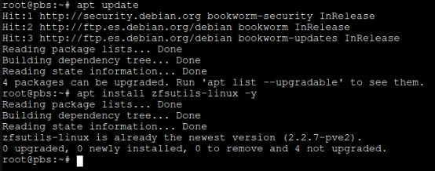
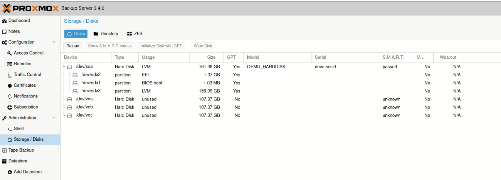
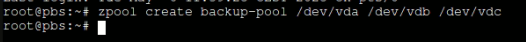
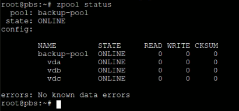
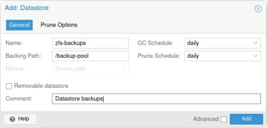
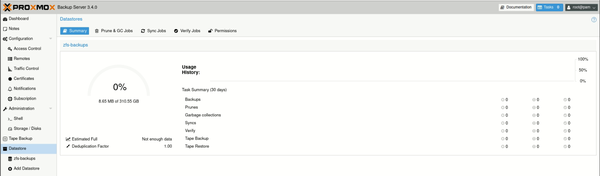
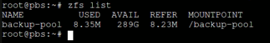

## 🚀 Passos per a crear un ZFS pool en Proxmox Backup Server (PBS)

### 🛑 **Requisits previs**

> ⚠️ Tots els discos seran esborrats. Assegura’t que **no continguen dades importants** abans de continuar.

---

### 🔧 Verificar instal·lació de ZFS

🔧  Instalar ZFS (si encara no está instalat)

```bash
apt update
apt install zfsutils-linux -y
```



Això confirma que el sistema està preparat per a treballar amb pools ZFS.

---

### 🗂️ Creació del ZFS pool

Existien tres opcions principals per a crear el pool ZFS, depenent del nombre de discos disponibles i les necessitats d’emmagatzematge i redundància:

* **Opció A**: `striped` – màxim espai però sense cap tolerància a fallades.
* **Opció B**: `mirror` – redundància completa però requereix un nombre parell de discos.
* **Opció C**: `raidz` – una combinació equilibrada entre espai disponible i tolerància a falles (similar a RAID 5).

👉 **Atés que en aquesta màquina només disposem de tres discos** (`/dev/vda`, `/dev/vdb` i `/dev/vdc`), la millor opció des del punt de vista tècnic és **RAIDZ**, ja que ens ofereix una bona capacitat d’emmagatzematge i alhora permet resistir la fallada d’un disc sense perdre les dades.



Per crear el pool:

```bash
zpool create backup-pool raidz /dev/vda /dev/vdb /dev/vdc
```



---

### ✅  Verificar l’estat del pool

Després de la creació, podem comprovar que el pool funciona correctament:

```bash
zpool status
```



Hauries de veure un estat **ONLINE** i el pool anomenat `backup-pool`.

---

### 🗃️ Crear el datastore en PBS

A través de la interfície web de PBS:

1. Anar a **Datastore > Create**
2. Omplir els camps:

   * **ID**: `zfs-backup`
   * **Path**: `/backup-pool` (punt de muntatge automàtic creat per ZFS)
3. Fer clic a **Create**

- Creació del **Datastore**





---

### 🔄 Comprovació i muntatge automàtic

ZFS gestiona automàticament el muntatge del pool. Per comprovar-ho:

```bash
zfs list
```

Resultat esperat:

```
NAME           USED  AVAIL  REFER  MOUNTPOINT
backup-pool    96K   900G    96K   /backup-pool
```



A partir d’aquest moment, el sistema ja pot utilitzar el datastore per a còpies de seguretat, amb les garanties que ofereix ZFS quant a integritat de dades i rendiment.

---

De la sección **"8. Seguridad y Buenas Prácticas"** del proyecto, aquí tienes acciones concretas para reforzar la seguridad en tu entorno Proxmox VE y PBS:

---

### **8.1. Actualización y parches de seguridad**
✅ **Acciones recomendadas:**
- **Actualizar regularmente**:
  ```bash
  apt update && apt dist-upgrade
  ```
- Habilitar **actualizaciones automáticas de seguridad**:
  ```bash
  apt install unattended-upgrades
  dpkg-reconfigure unattended-upgrades
  ```
- Verificar parches de Proxmox:
  ```bash
  pveam update
  ```

---

### **8.2. Configuración de firewall en Proxmox**
✅ **Acciones recomendadas:**
- Activar el **firewall integrado** en Proxmox (GUI: `Datacenter > Firewall`).
- Reglas básicas:
  - Permitir solo SSH (puerto 22), Proxmox Web (8006) y Ceph (si se usa) desde IPs confiables.
  - Bloquear accesos externos a APIs no necesarias.
- Ejemplo para permitir acceso web desde una IP específica:
  ```bash
  pve-firewall localnet add -enable 1 -policy in -action ACCEPT -dport 8006 -source 192.168.1.100
  ```

---

### **8.3. Copias de seguridad de la configuración**
✅ **Acciones recomendadas:**
- **Backup de la configuración del clúster**:
  ```bash
  tar -czvf /backup/proxmox_config_$(date +%Y-%m-%d).tar.gz /etc/pve/
  ```
- **Automatizar backups** con PBS:
  - Programar backups diarios/semanales de VMs/LXCs (GUI: `PBS > Datastore > Backup Jobs`).
  - Usar **retención incremental** (ejemplo: 7 días diarios + 4 semanales).

---

### **8.4. Buenas prácticas de administración**
✅ **Acciones recomendadas:**
- **Usar autenticación de dos factores (2FA)** para la GUI de Proxmox (GUI: `Datacenter > Permissions > Users`).
- **Restringir acceso SSH**:
  ```bash
  nano /etc/ssh/sshd_config
  ```
  - Añadir: `PermitRootLogin no`, `PasswordAuthentication no` (usar claves SSH).
- **Monitoreo**:
  - Configurar alertas por email (GUI: `Datacenter > Notifications`).
  - Usar `ceph health` y `pveperf` para vigilar rendimiento.


---