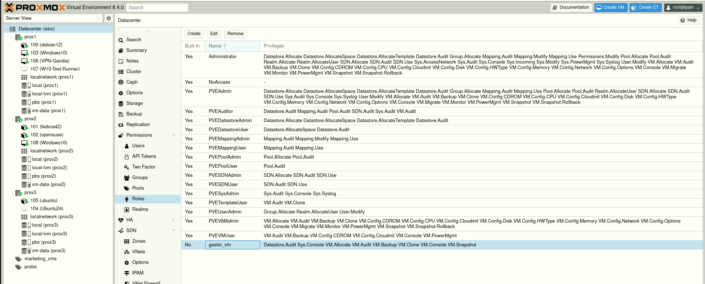
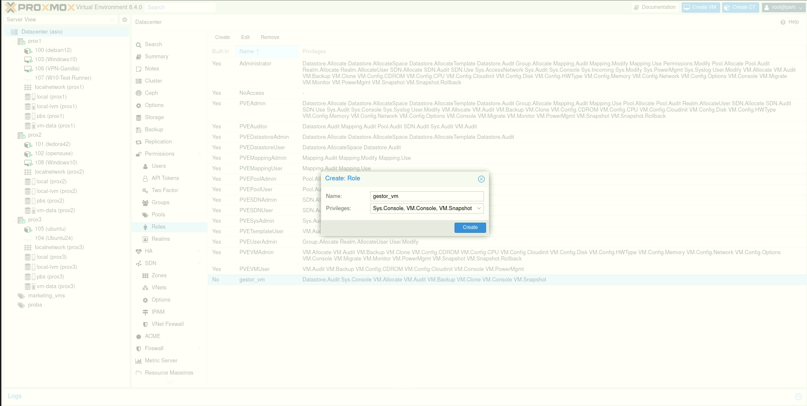
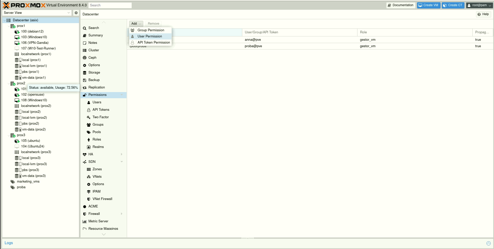

# 3. 🖥️ Implementació del Clúster Proxmox

A continuació et detallem pas a pas com crear un clúster en Proxmox i unir-hi altres nodes.

---

## 🛠️ 1. Crear el Clúster

1. Accedeix a un dels nodes de Proxmox.
2. Ves a **Datacenter → Cluster** des del menú lateral esquerre.
3. Fes clic a **Crear Clúster** (`Create Cluster`).


4. Ompli les dades del clúster:

   * **Nom del Clúster**
   * **Interfície de xarxa**
   * Altres paràmetres segons la teua configuració

<p align="center">
  
</p>

<p align="center">
  
</p>

5. Un cop creat, veuràs el node com a part del clúster.


---

## 🔗 2. Unir Nodes al Clúster

Per afegir un altre node al clúster:

1. Accedeix al segon node i ves a **Datacenter → Cluster**.
2. Fes clic a **Unir-se al clúster** (`Join Cluster`).


3. A continuació, hauràs d’introduir la **informació del clúster**.

<p align="center">
  
</p>

4. Per obtindre aquesta informació, torna al node principal del clúster i fes clic a **Join Information**.


5. Copia aquesta informació i torna al node secundari. Enganxa-la al formulari per unir-se.

<p align="center">
  
</p>

6. Fes clic a **Unir-se**. Si tot és correcte, el node s’afegirà automàticament al clúster.


---

## ➕ 3. Afegir més nodes

Per afegir més nodes, repeteix exactament el mateix procés:

* Accedeix al node
* Ves a **Datacenter → Cluster**
* Fes clic a **Unir-se al clúster**
* Copia la informació del node principal
* Enganxa-la i uneix el node

---

🔚 I amb això ja tindràs un clúster Proxmox funcional amb diversos nodes!


Perfecte! Comencem pel punt **4.1 Introducció a Ceph i integració amb Proxmox**. Et deixe a continuació una proposta redactada en valencià formal, clara i adequada per al teu projecte:

---

### 🧠 4 Introducció a **Ceph** i Integració amb **Proxmox VE**

**Ceph** és una plataforma d’emmagatzematge distribuït de codi obert dissenyada per oferir alta disponibilitat, escalabilitat i rendiment, sense punts únics de fallada. El seu funcionament es basa en tres components principals:

* **OSD (Object Storage Daemon):** Gestiona el disc dur on s’emmagatzema la informació.
* **MON (Monitor):** Controla l’estat del clúster, manté el mapa del clúster i garanteix el consens entre nodes.
* **MGR (Manager):** Proporciona funcionalitats addicionals de monitoratge i interfície web.

Ceph permet oferir emmagatzematge per a:

* Màquines virtuals (amb RBD – Rados Block Device)
* Sistemes d’arxius (CephFS)
* Objectes (compatible amb S3)

---

#### 🔗 Integració amb Proxmox VE

**Proxmox VE** incorpora suport nadiu per a Ceph, cosa que facilita la seua instal·lació, gestió i integració des de la mateixa interfície web o via línia de comandes.

Gràcies a aquesta integració:

* Es pot configurar Ceph directament des de la interfície de **Datacenter → Ceph**
* Els discos Ceph (RBD) poden ser utilitzats com a **emmagatzematge de màquines virtuals** i **contenidors (LXC)**
* El sistema garanteix **alta disponibilitat**, ja que les dades estan replicades en diversos nodes
* Permet una **escala horitzontal** fàcil, afegint més discos o nodes al clúster Ceph

---

💡 **Per què utilitzar Ceph en Proxmox?**

* Elimina la dependència de sistemes d’emmagatzematge extern (NFS, iSCSI, etc.)
* Millora la tolerància a fallades i la continuïtat del servei
* Ofereix una gestió centralitzada i unificada del clúster i l’emmagatzematge

Perfecte! Ací tens el punt **4.2 Instal·lació i configuració de Ceph al clúster**, redactat en valencià formal i pensat per a un projecte tècnic:

---

### 4.2 ⚙️ Instal·lació i Configuració de **Ceph** al Clúster

La instal·lació de Ceph en un entorn **Proxmox VE** es pot fer de manera centralitzada i senzilla gràcies a la seua integració nativa. A continuació es detallen els passos principals per a desplegar Ceph en un clúster de Proxmox:

---

#### 🧩 Requisits previs

Abans de començar amb la instal·lació, cal assegurar:

* Tots els nodes tenen l’hora sincronitzada via **NTP**
* Una xarxa específica o VLAN dedicada per al trànsit de Ceph (preferiblement amb baixa latència i alta amplada de banda)
* Discos dedicats per a Ceph (no utilitzar el mateix disc que el sistema operatiu)
* Una configuració bàsica del clúster de Proxmox ja establida

---

#### 🛠️ Passos d’instal·lació

1. **Accedir a la interfície web de Proxmox**

   * Ves a `Datacenter → Ceph`

2. **Instal·lar Ceph als nodes**

   * Selecciona cada node on vols desplegar Ceph
   * A l’apartat `Ceph`, fes clic a **Install Ceph**
   * El sistema instal·larà automàticament els paquets necessaris (`ceph`, `ceph-common`, etc.)


3. **Crear els monitors (MON)**

   * Un mínim de **tres monitors** és recomanat per garantir el quorum
   * Des de l’apartat `Monitor`, fes clic a **Create Monitor**


4. **Afegir el gestor (MGR)**

   * Necessari per a la interfície gràfica i gestió avançada
   * Crea’l des de la mateixa pestanya amb el botó **Create Manager**


5. **Afegir els OSDs (Object Storage Daemons)**

   * Els OSDs són els processos que gestionen els discos durs del clúster
   * Ves a `OSD → Create OSD`, selecciona el disc físic i crea’l
   * Repeteix el procés per a cada node i disc dedicat


<p align="center">
  
</p>

* Com tenim 2 discos per cada node (menos en el node 3 que sols hi ha 1)de proxmox haurem de repetir el proccess dos voltes

**Node 1:**


**Node 2**


**Node 3**


1. **(Opcional) Crear un MDS (Metadata Server)**

   * Només si vols utilitzar **CephFS** com a sistema de fitxers compartit

    ##### **📂 Què són els metadades?**
    Els metadades són informació sobre els fitxers, com ara:

    Noms de fitxers i directoris

    Jerarquia de carpetes

    Permisos d’accés

    Propietaris

    Dates de creació o modificació

    
    ##### 🧠 Què fa exactament el MDS?
    
    Quan utilitzes CephFS (el sistema de fitxers distribuït de Ceph), el Metadata Server:

    Controla l’estructura i organització del sistema de fitxers

    Processa operacions com ls, mkdir, rm, mv, etc.

    Fa que les consultes de fitxers siguen ràpides i escalables

    Allibera als OSDs d’aquesta tasca perquè es centren només en llegir i escriure dades

Perfecte! Ací tens el punt **4.3 Creació de pools d’emmagatzematge** redactat de manera formal i clara en valencià, seguint l’estil dels punts anteriors:

---

### 4.3 🏗️ Creació de Pools d’Emmagatzematge en Ceph

Els **pools d’emmagatzematge** són una part fonamental en l’arquitectura de **Ceph**, ja que representen els espais lògics on es distribueixen les dades entre els diferents OSDs del clúster. A cada pool se li pot assignar una funció específica, com ara allotjar màquines virtuals, contenidors o fitxers de CephFS.

---

### 🔍 Què és un Pool?

Un **pool** és una agrupació lògica d’objectes dins del clúster Ceph. Cada objecte dins d’un pool es reparteix entre els OSDs segons una política de distribució definida, garantint així la replicació i la tolerància a fallades.

---

### 🛠️ Creació d’un Pool pas a pas en Proxmox VE

1. Accedeix a la interfície web de **Proxmox VE**
2. Ves a `Datacenter → Ceph → Pools`
3. Fes clic a **Create**


4. Emplena els camps següents:


   * **Nom del pool:** (ex. `vm_data`, `cephfs_data`, `backups`)
   * **Nombre de rèpliques (Size):** recomanat mínim **3** per a alta disponibilitat
   * **Min. rèpliques (Min. Size):** mínim **2** per a mantenir el servei actiu amb una fallada
   * **Crush Rule:** regla de distribució entre els dispositius de disc

<p align="center">
  
</p>

1. Fes clic a **Create** i espera a que el pool aparega a la llista


Al pas d'un temps podem veure com en els nodes apareix l'almacenament del ceph.


---

### 🧠 Consideracions importants

* Els pools amb més rèpliques consumeixen més espai però ofereixen més redundància.
* És possible crear **pools separats** per a diferents usos (ex: un per a VM i un altre per a CephFS).
* Es poden utilitzar **regles CRUSH** per controlar com es distribueixen les dades per racks, discos o ubicacions físiques.

---

### ✅ Resultat

Amb el pool creat, ja pots:

* Assignar-lo com a **emmagatzematge de màquines virtuals (RBD)**
* Utilitzar-lo per a **CephFS**
* Monitorar el seu estat i ús des de la pestanya de **Ceph → Pools**

Perfecte! A continuació et presente el punt **4.4 Proves de rendiment i replicació** redactat de manera formal i clara, mantenint l’estil del teu projecte en valencià:

---

### 4.4 🚀 Proves de Rendiment i Replicació en Ceph

Una vegada el clúster Ceph està desplegat i operatiu, és fonamental realitzar proves de **rendiment** i **replicació** per a verificar el correcte funcionament de l’emmagatzematge distribuït, així com garantir la **fiabilitat** i **eficiència** del sistema.

---

### 📊 Proves de rendiment

Les proves de rendiment ens permeten mesurar la **velocitat de lectura i escriptura** dels dispositius Ceph, així com la **latència** i **capacitat de resposta** del clúster.

#### 🧪 Eines recomanades:

* `rados bench` → eina pròpia de Ceph per mesurar el rendiment de lectura/escriptura
* `fio` → eina externa per fer proves personalitzades d’I/O

#### Exemple amb `rados bench`:

```bash
# Prova d'escriptura durant 60 segons
rados bench -p vm-data 60 write --no-cleanup

# Prova de lectura seqüencial
rados bench -p vm-data 60 seq

# Prova de lectura aleatòria
rados bench -p vm-data 60 rand
```

<p align="center">
  
</p>

### ✅ Resultat esperat

* Les proves d’escriptura i lectura han de mostrar valors de rendiment estables i adequats segons el teu hardware.
* La replicació ha de funcionar de manera automàtica, garantint la integritat i disponibilitat de les dades davant qualsevol fallada.

#### 📌 Exemple de comandes via CLI

Alternativament, es pot fer la instal·lació via línia de comandes:

```bash
# Instal·lar Ceph
pveceph install

# Crear un monitor
pveceph mon create

# Crear un OSD
pveceph osd create /dev/sdX
```

---

### ✅ Resultat

Una vegada configurats els **MON**, **MGR** i **OSD**, el clúster Ceph estarà operatiu. Ja pots procedir a:

* Crear **pools d’emmagatzematge**
* Assignar-los com a backend per a màquines virtuals
* Monitorar l’estat del clúster des de la interfície de Proxmox

---

### ♻️ Proves de replicació

Ceph replica les dades entre OSDs segons la configuració de rèpliques (per defecte 3). És important verificar que:

1. **Les dades es repliquen correctament** a múltiples discos.
2. **Quan cau un OSD o node**, Ceph automàticament redistribueix les rèpliques.

#### 🔄 Prova de fallada simulada:

1. Apaga un OSD manualment:

   ```bash
   systemctl stop ceph-osd@X
   ```

   (on `X` és el número de l’OSD)


2. Observa com Ceph reporta l’estat *degraded* i com reubica les dades.


3. Torna a engegar l’OSD i comprova la **reestructuració automàtica**:

   ```bash
   systemctl start ceph-osd@X
   ```


---

### 📈 4.5 Gestió i Monitoratge de **Ceph**

Una vegada desplegat el clúster **Ceph**, és fonamental realitzar una gestió i monitoratge continuat per garantir l’estabilitat, el rendiment i la disponibilitat de les dades. Proxmox VE ofereix una **integració nativa amb Ceph**, que facilita tant el control operatiu com la detecció anticipada de possibles incidències.

---

### 🛠️ Eines de gestió disponibles

Proxmox proporciona diversos mètodes per gestionar Ceph:

#### 📌 Interfície web de Proxmox VE

Des de la GUI es pot accedir a:

* **Estat del clúster**: `Datacenter → Ceph → Status`
* **Gestió d’OSDs**: afegir, eliminar o veure l’estat dels Object Storage Daemons
* **Monitors (MONs)** i **Managers (MGRs)**: estat, creació i falles
* **Creació i eliminació de pools**
* **Configuració i gestió de CephFS**

#### 🔧 Línia de comandes (CLI)

Per a gestió avançada i automatitzacions:

```bash
ceph status             # Estat general del clúster
ceph osd tree           # Visualització jeràrquica dels OSDs
ceph df                 # Ús d’espai en pools
ceph health detail      # Informació detallada de salut
ceph osd out/in <id>    # Marcar un OSD com a fora o dins del clúster
```

---

### 📊 Monitoratge actiu del clúster

Els principals paràmetres a controlar de forma contínua són:

* **Salut del clúster (HEALTH\_OK / WARN / ERR)**
* **Nombre d’OSDs actius i en línia**
* **Estat dels MON i MGR**
* **Ús de l’espai per pool i per OSD**
* **Latències de lectura i escriptura**
* **Rebalanceig de dades en cas de fallada o afegit de nous discos**

---

### 📡 Integració amb eines externes

Encara que Proxmox proporciona visualització bàsica, pots integrar Ceph amb eines de monitoratge més potents com:

* **Prometheus + Grafana** (via Ceph MGR modules)
* **Zabbix** o **Nagios**, mitjançant plugins
* Alertes per correu electrònic o sistemes de notificació

---

### 💡 Recomanacions de manteniment

* 🔁 **Revisar l’estat del clúster regularment**
* 🧪 **Simular fallades controlades** per validar la replicació i recuperació
* 📦 **No sobrecarregar els OSDs**; mantindre un marge de capacitat lliure
* 🛑 **Evitar la pèrdua simultània de múltiples discos** amb rèpliques mínimes

---

### ✅ Resultat

Amb una correcta gestió i monitoratge, es garanteix que el clúster Ceph oferisca un rendiment estable, altament disponible i resistent a fallades, adaptat a les necessitats de l’entorn virtualitzat en Proxmox VE.


Perfecte! Ací tens el punt **5. Alta Disponibilitat (HA)** completament redactat en valencià formal i tècnic, amb icones i una estructura clara per a incloure’l al teu projecte:

---

## 🛡️ 5. Alta Disponibilitat (**HA**) en Proxmox VE

La **Alta Disponibilitat (High Availability)** és una funcionalitat clau en entorns crítics, ja que permet garantir la **continuïtat del servei** davant la caiguda d’un node. Amb Proxmox VE, aquesta característica s’integra de manera nativa quan es treballa amb un **clúster**.

---

### ⚙️ 5.1 Activació del Gestor HA en Proxmox

Per a fer ús de la funcionalitat HA, cal que:

1. El clúster estiga format per almenys **3 nodes** (per mantenir el **quorum**)
2. Els nodes tinguen **Corosync** i **pve-ha-crm** actius
3. Els recursos (VM o CT) estiguen ubicats en **storage compartit** o Ceph

#### 🔄 Procediment:

* Ves a `Datacenter → HA`
* Assegura’t que el **HA Manager** està actiu
* Cada node mostrarà el seu estat (online, standby, etc.)

<p align="center">
  
</p>

---

### 🧩 5.2 Definició de Grups HA

Els **grups HA** permeten organitzar i assignar màquines virtuals o contenidors per a gestionar millor les polítiques de tolerància a fallades.

#### Creació d’un grup HA:

1. Ves a `Datacenter → HA → Groups`


1. Fes clic a **Create**
2. Assigna:

<p align="center">
  
</p>

   * **Nom del grup**
   * **Nodes preferits** per executar el servei
   * **Prioritats** (per decidir on s’hauria de migrar en cas de fallada)

Després, quan crees o edites una VM/CT, pots assignar-la a un grup HA.

---

### 🔁 5.3 Proves de Tolerància a Fallades (Failover de Màquines Virtuals)

Per assegurar el correcte funcionament de la configuració HA, és recomanable fer proves de **failover controlades**:

#### Escenari de prova:

1. Assigna una VM a un grup HA

<p align="center">
  
</p>

2. Para o apaga un node manualment


3. Observa com la VM és **migrada automàticament** a un altre node disponible
4. Verifica que el servei continua operatiu sense intervenció manual


🔍 Es pot monitorar aquest procés des de `Datacenter → HA → Status`.


Per descomptat! Ací tens el fragment redactat de manera formal i clara, ideal per afegir com a continuació dins del punt 5.4 o com un subapartat pràctic de **recuperació post-fallada**:

---

### 💡 5.4 Casos d’Ús i Recuperació davant Caigudes de Nodes

Els entorns amb HA actiu poden recuperar-se de forma automàtica en diferents situacions:

* 🔌 **Fallada de hardware o energia** en un node
* 🧯 **Actualitzacions crítiques** que requereixen reinici
* ⚙️ **Errors de sistema** o problemes de rendiment greu

En cada cas:

* El sistema HA detecta la fallada
* Migració automàtica a nodes disponibles
* Restauració del servei amb **temps mínim d’interrupció**

#### Exemple pràctic:

Una màquina virtual crítica (servidor web, base de dades, etc.) està configurada amb HA. Si el node cau inesperadament, aquesta VM es reinicia en un altre node en qüestió de segons, garantint la continuïtat del servei.

---

### ✅ Resultat

Amb la configuració HA en Proxmox VE, es millora significativament la **resiliència de la infraestructura virtualitzada**, assegurant que els serveis essencials estiguen disponibles **24/7**, fins i tot davant fallades greus.

---


### 🔁 Recuperació manual de màquines HA al seu node original

Després d’una **caiguda temporal d’un node** del clúster, el sistema **HA de Proxmox** trasllada automàticament les màquines virtuals o contenidors afectats a un altre node disponible per garantir la continuïtat del servei.

Un cop el node original torna a estar **en línia i estable**, és **recomanable migrar manualment** les màquines al seu node d'origen per:

* Recuperar l’equilibri de càrrega del clúster
* Retornar els recursos als seus entorns habituals
* Preparar el sistema per a futures fallades

---

### ⚙️ Procediment per a migrar una màquina HA al node original

1. Accedeix a la interfície web de Proxmox
2. Ves al node on actualment està executant-se la màquina
3. Selecciona la màquina virtual o contenidor
4. Fes clic a **"Migrate"**
5. Tria com a destinació el **node original** (ex: `node3`)
6. Confirma l’operació

📌 *Nota:* La migració es pot fer en calent (**live migration**) si la màquina suporta aquesta funcionalitat (generalment les VMs amb discs en Ceph o ZFS compartit).

---

### ✅ Resultat

Amb aquest procés, la màquina recupera la seua ubicació inicial, mantenint-se dins del grup HA i **preparada per a futures gestions automàtiques** de tolerància a fallades.


---

## 👥 7. Gestió d’Usuaris i Pools de Recursos

En entorns virtualitzats compartits, com un clúster de **Proxmox VE**, és fonamental establir una **gestió d’usuaris estructurada**, amb **permisos diferenciats** i assignació clara de **recursos**, per garantir la **seguretat, control i eficiència operativa**.

---

### 🔐 7.1 Creació de Rols Personalitzats i Permisos

**Proxmox VE** ofereix un sistema de permisos basat en rols, que permet definir què pot fer cada usuari dins del sistema. Aquest model RBAC (Role-Based Access Control) es basa en tres elements:

* **Usuaris** (local, LDAP o via PAM)
* **Rols** (conjunts de permisos)
* **Objectes** (nodes, VM, storage, etc.)

#### 🔧 Creació d’un rol personalitzat:

1. Ves a `Datacenter → Permissions → Roles`
2. Fes clic a **Add**
3. Assigna un nom (ex. `gestor_vm`)
4. Selecciona els permisos específics:

   * `VM.Allocate`
   * `VM.Config.Disk`
   * `VM.Console`
   * `Sys.Console`





#### ➕ Assignació del rol:

1. Ves a `Permissions → Add → Users`
2. Selecciona:

   * **Path:** àrea de control (`/`, `/vms`, `/pool/nom`, etc.)
   * **User:** usuari o grup
   * **Role:** el rol que has creat

Això permet donar accés restringit a determinats recursos dins del clúster.




En este cas he creat un usuari de prova per a assignar el rol creat.


---

### 🗂️ 7.2 Definició de Pools de Recursos

Els **pools** són agrupacions lògiques de recursos (VMs, CTs, discos, etc.) que permeten facilitar la gestió, especialment en entorns multiusuari o amb departaments diferenciats.

#### 🛠️ Creació d’un pool:

1. Ves a `Datacenter → Permissions → Pools`
2. Fes clic a **Create**


1. Emplena:

   * **Nom del pool:** ex. `departament_it`, `desenvolupament`
   * **Descripció** (opcional)


1. Afegeix les VMs o CTs desitjades al pool

En este cas anem a fer que el usuari proba puga vore la vm 108(Windows10)


Assignacio del pool al usuari proba amb el rol  que hem creat.


Els pools són útils per:

* Aplicar permisos a grups d’usuari de forma més eficient
* Organitzar recursos segons projectes o àrees de treball
* Limitar l’accés només a les màquines assignades

---

### 👤 7.3 Gestió Delegada i Multiusuari

Amb els **rols** i **pools**, es pot habilitar un entorn **multiusuari segur**, on cada usuari o equip tinga accés només als recursos que li pertoquen.

#### Exemple de gestió delegada:

* **Usuari:** `anna@pve`
* **Pool assignat:** `marketing_vms`
* **Rol aplicat:** `PVEVMUser` (amb permisos per iniciar/parar/migrar màquines)
* Resultat: Anna només pot gestionar les VMs del pool `marketing_vms`, sense accedir a cap altre recurs del sistema


---

### ✅ Beneficis

* 🔒 Major seguretat mitjançant la separació de privilegis
* 👨‍👩‍👧‍👦 Facilitat per delegar la gestió a equips tècnics o usuaris finals
* 🧩 Escalabilitat per a entorns educatius, empresarials o d'hosting

---

## 🧪 Casos Pràctics de Gestió Delegada i Multiusuari en Proxmox VE

### 🎓 **Cas 1: Entorn educatiu amb alumnes de pràctiques**

#### Escenari:

L’institut ha desplegat un clúster de Proxmox per a alumnes del cicle de sistemes. Cada alumne ha de gestionar una VM pròpia, però sense accés al sistema complet.

#### Configuració:

* **Usuari:** `alumne01@pve`
* **Pool:** `alumnes`
* **VM assignada:** `vm105` (Debian pràctica)
* **Rol:** `PVEVMUser`

#### Resultat:

L’alumne pot:

* Engegar/parar la seua VM
* Accedir per consola
* No pot crear ni esborrar màquines
* No pot veure cap altra VM

---

### 🏢 **Cas 2: Departament de Desenvolupament en una empresa**

#### Escenari:

L’equip de desenvolupament necessita accedir a diverses màquines de testing, però no ha de poder modificar la infraestructura general.

#### Configuració:

* **Usuaris:** `david@pve`, `jordi@pve`
* **Pool:** `dev_pool`
* **Rols:** `gestor_vm_custom` (creat amb permisos limitats com `VM.Console`, `VM.Start`, `VM.Shutdown`)

#### Resultat:

Els usuaris poden:

* Utilitzar i gestionar les seues VMs
* No poden crear VMs noves ni modificar configuracions globals

---

### 🛠️ **Cas 3: Tècnic amb accés complet a un node concret**

#### Escenari:

Un tècnic extern col·labora en la gestió de sistemes, però només se li vol donar accés al node `node3`.

#### Configuració:

* **Usuari:** `tecnic@pve`
* **Àrea assignada:** `/nodes/node3`
* **Rol:** `PVEAdmin`

#### Resultat:

Té accés complet només a les màquines i configuració d’eixe node, però no pot accedir a altres nodes ni al datacenter.

---

### 🧩 **Cas 4: Hosting amb gestió delegada per client**

#### Escenari:

Una empresa ofereix màquines virtuals com a servei. Cada client gestiona la seua pròpia màquina.

#### Configuració:

* **Client:** `client_a@pve`
* **Pool:** `client_a_pool`
* **VM assignada:** `vm201`
* **Rol:** `PVEVMUser`

#### Resultat:

Cada client pot administrar la seua pròpia màquina, sense cap visibilitat sobre altres clients o parts del sistema.

---

### ✅ Conclusions dels casos pràctics

Aquests escenaris mostren com Proxmox permet adaptar-se fàcilment a entorns **multiusuari**, amb control granular de permisos i una gestió segura i delegada, mantenint la **seguretat**, **eficiència** i **flexibilitat** del sistema.

---