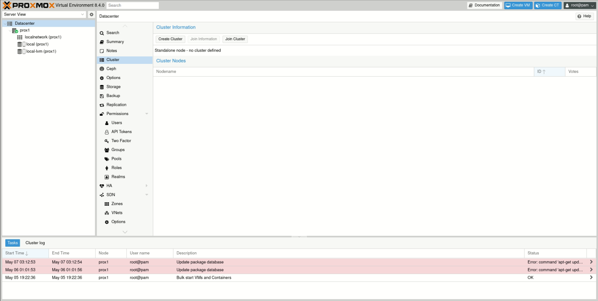
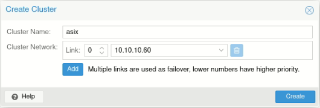
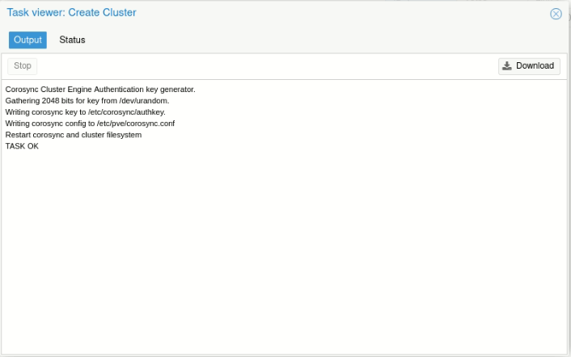
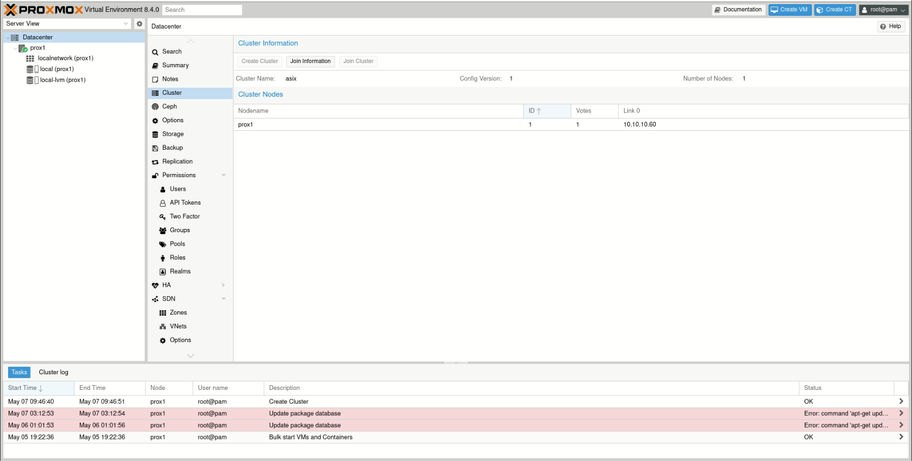
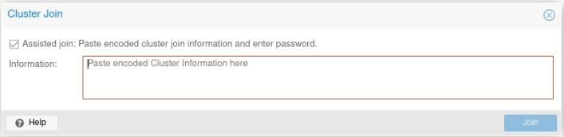
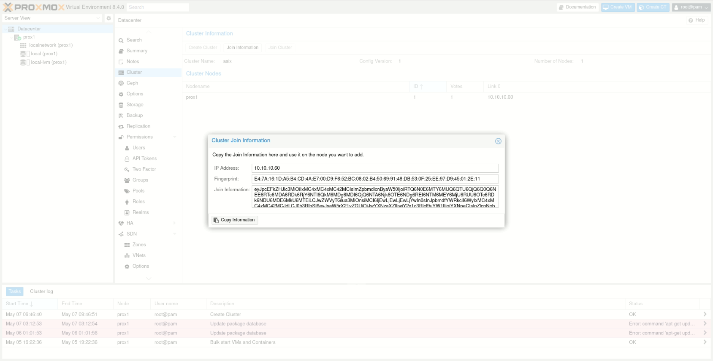
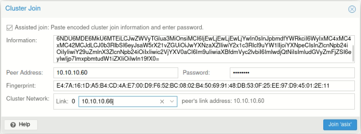
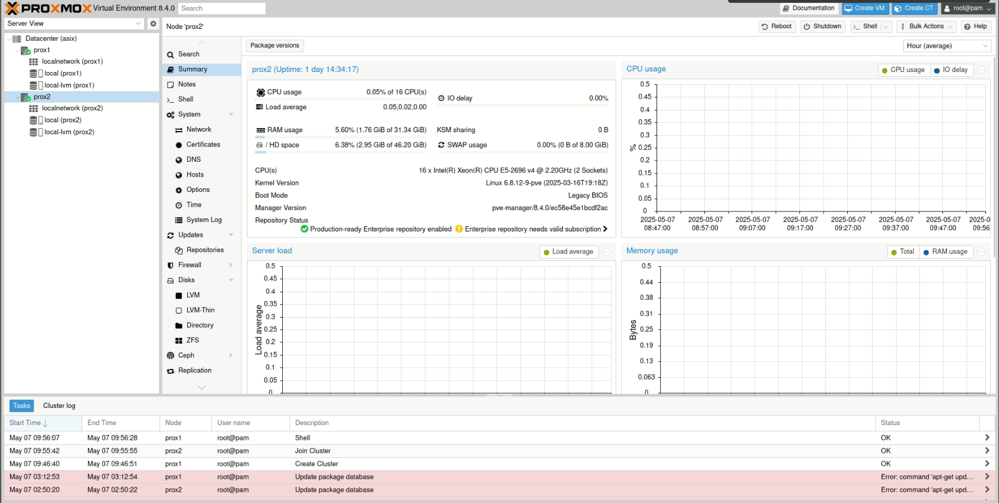

# 🌐 Creació d’un Clúster amb **Proxmox VE**

A continuació et detallem pas a pas com crear un clúster en Proxmox i unir-hi altres nodes.

---

## 🛠️ 1. Crear el Clúster

1. Accedeix a un dels nodes de Proxmox.
2. Ves a **Datacenter → Cluster** des del menú lateral esquerre.
3. Fes clic a **Crear Clúster** (`Create Cluster`).

4. Ompli les dades del clúster:

   * **Nom del Clúster**
   * **Interfície de xarxa**
   * Altres paràmetres segons la teua configuració

  

  

5. Un cop creat, veuràs el node com a part del clúster.

---

## 🔗 2. Unir Nodes al Clúster

Per afegir un altre node al clúster:

1. Accedeix al segon node i ves a **Datacenter → Cluster**.
2. Fes clic a **Unir-se al clúster** (`Join Cluster`).

3. A continuació, hauràs d’introduir la **informació del clúster**.

  

4. Per obtindre aquesta informació, torna al node principal del clúster i fes clic a **Join Information**.

5. Copia aquesta informació i torna al node secundari. Enganxa-la al formulari per unir-se.

  

6. Fes clic a **Unir-se**. Si tot és correcte, el node s’afegirà automàticament al clúster.

---

## ➕ 3. Afegir més nodes

Per afegir més nodes, repeteix exactament el mateix procés:

* Accedeix al node
* Ves a **Datacenter → Cluster**
* Fes clic a **Unir-se al clúster**
* Copia la informació del node principal
* Enganxa-la i uneix el node

---

🔚 I amb això ja tindràs un clúster Proxmox funcional amb diversos nodes!

