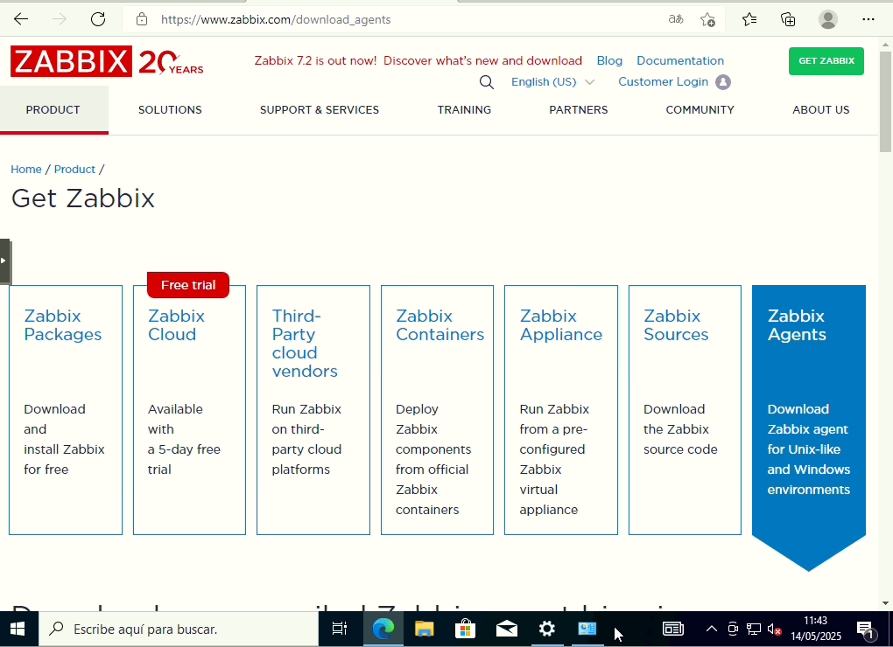
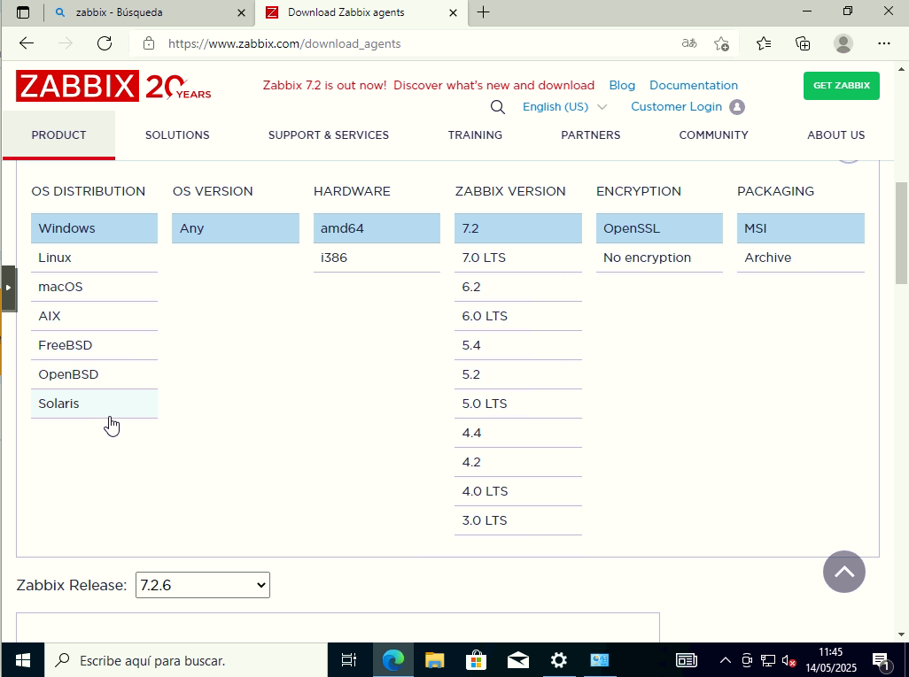
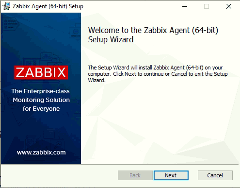
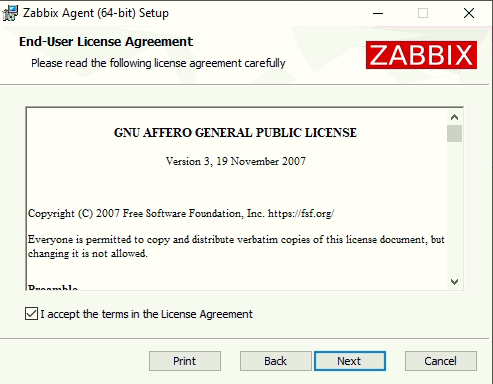
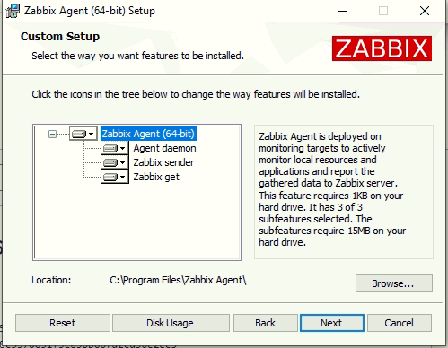
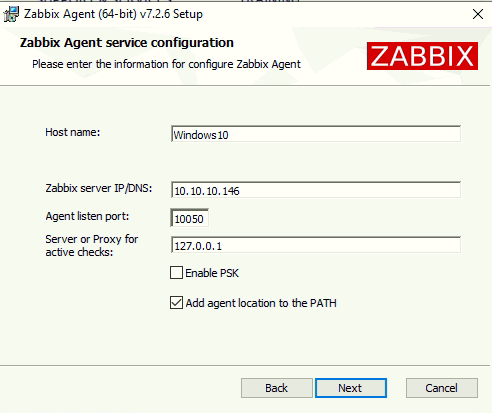
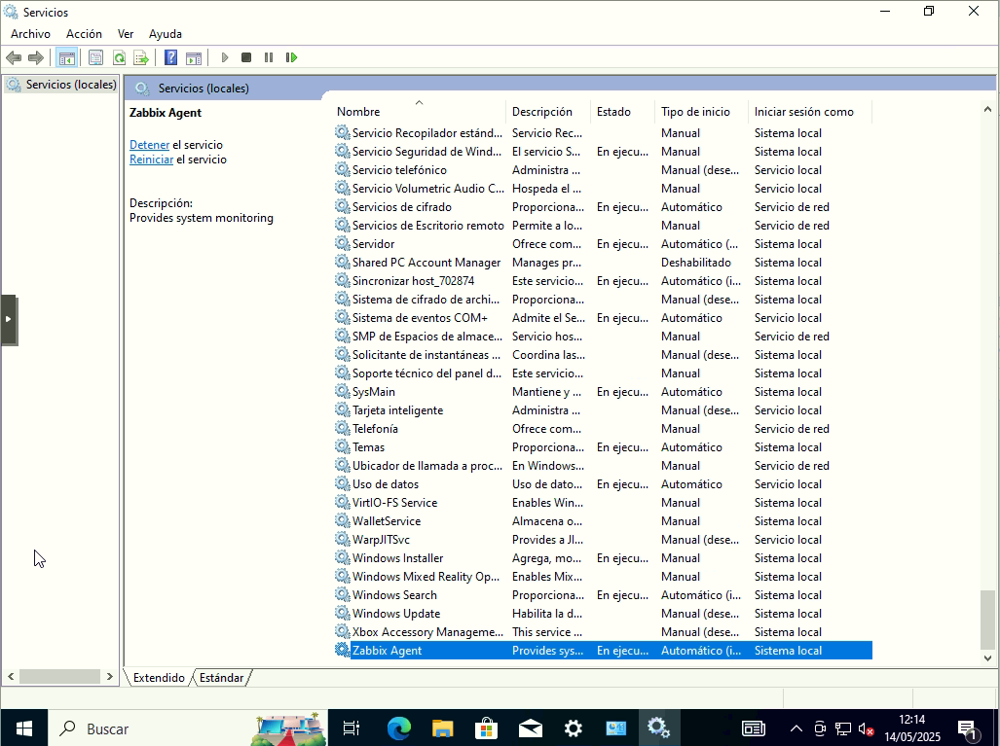
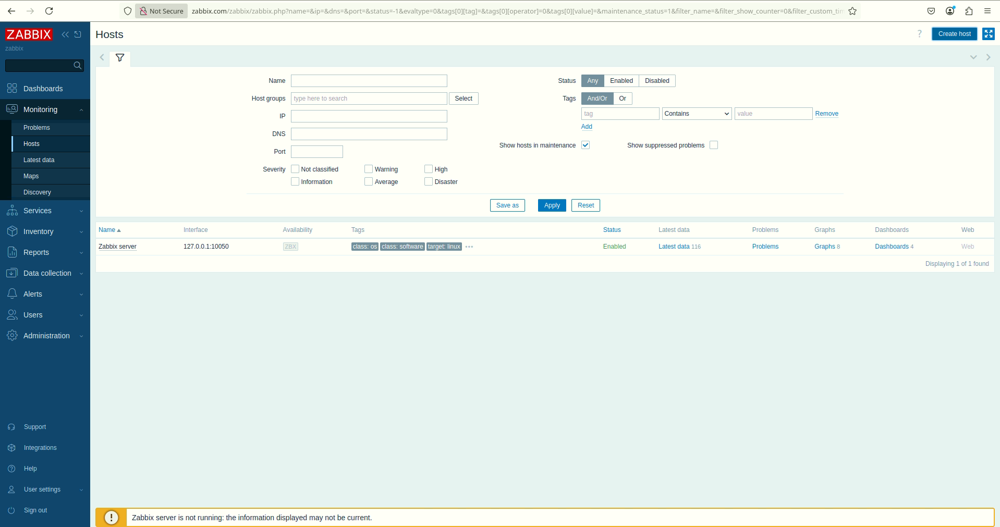
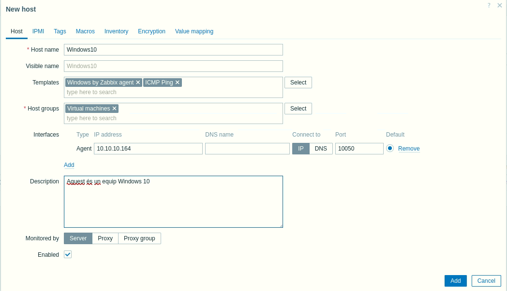

# 9.6 Afegeix un host al monitoratge Zabbix

El primer host que vamos a instalar es en un Windows lo primero que tenemos que hacer es ir a la web de Zabbix para instalar el agente.

Luego selecionamos em que sistema operativo estamos, la version del zabbix, el tipo de encriptacion y el formato del paquete.

Lo descargamos y lo ejecutamos.

Y podemos ver como el servicio esta corriendo.

Ahora para agregar-lo  tenemos que ir a la parte de **Monitoring -> Hosts -> Create Host**

Para instalar un host Linux tenemo que hacer los siguientes passos.

