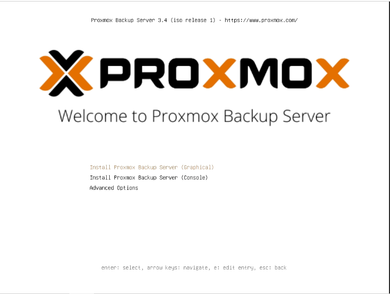
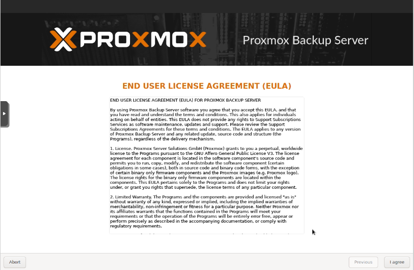
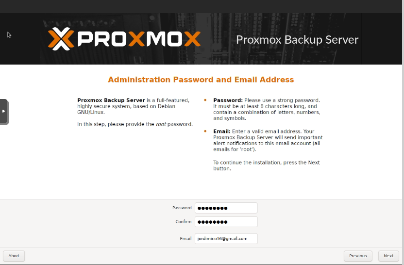
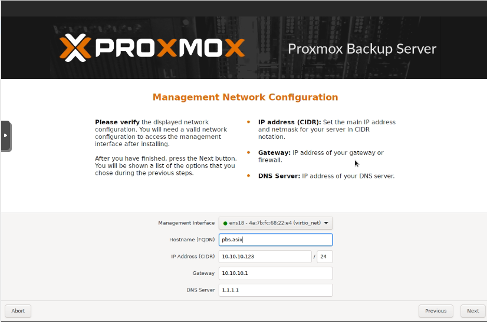
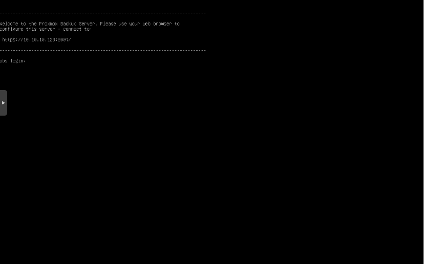
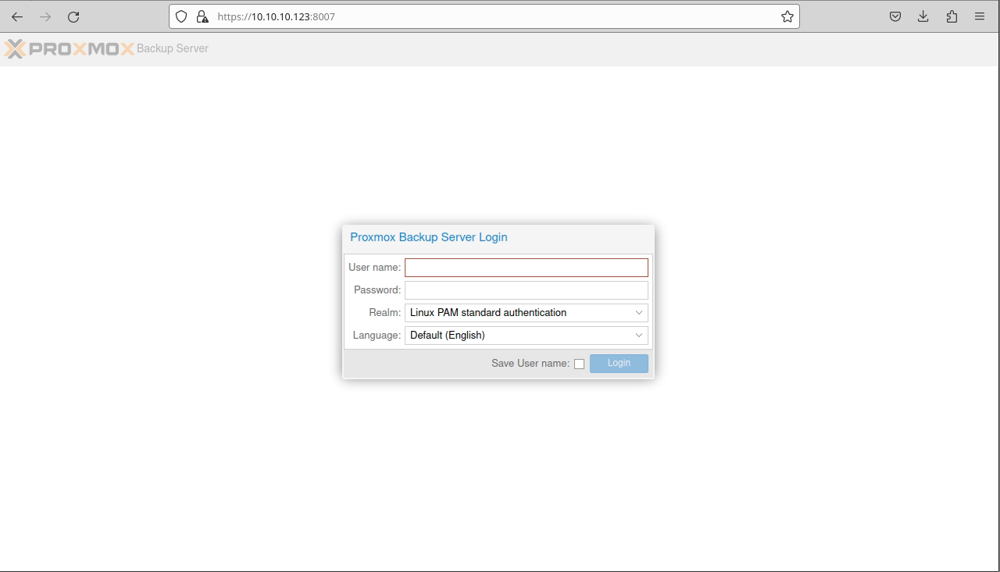

## 💻 Proxmox Backup Server (PBS)

###  Instalación de PBS

**Passos per a la instal·lació:**

1. Baixem la imatge *ISO* de Proxmox Backup Server des de la [web oficial](https://proxmox.com/en/downloads), triant l’última versió disponible.
2. Una vegada descarregada, la col·loquem en el dispositiu des d'on farem la instal·lació en l’equip.

---

🔸 El primer pas, després de col·locar la *ISO*, és la càrrega del menú *GRUB*, on hem de seleccionar el procés d’instal·lació desitjat. En este cas, triarem l'opció amb interfície gràfica.



🔸 A continuació, acceptem la **llicència d’ús** del programari.



🔸 En el següent pas, seleccionem en quin disc volem instal·lar Proxmox. En este exemple només tenim un disc disponible, així que el seleccionem. També podem configurar el sistema de fitxers. Triem **ext4**.


🔸 Introduïm la **contrasenya d’administració** i un **correu electrònic** per a notificacions del sistema.



🔸 Assignem el **nom del *host***, la **IP**, el **gateway** i els **DNS**.



🔸 Finalment, es mostra un **resum de la configuració** triada. Confirmem i iniciem la instal·lació.


🔸 Un cop finalitzada la instal·lació, a la consola apareixerà un missatge indicant que podem accedir a la interfície web de Proxmox via:

```
https://10.10.10.123:8006
```



🔸 Així accedim a la **interfície web de Proxmox VE**:

