##  💻 Implementació del *Clúster* Proxmox

### Instal·lació dels nodes Proxmox VE

#### 🧱 Instal·lació del primer node de Proxmox

**Passos per a la instal·lació:**

1. Baixem la imatge *ISO* de Proxmox des de la [web oficial](https://proxmox.com/en/downloads), triant l’última versió disponible.
2. Una vegada descarregada, la col·loquem en el dispositiu des d'on farem la instal·lació en l’equip.

---

🔸 El primer pas, després de col·locar la *ISO*, és la càrrega del menú *GRUB*, on hem de seleccionar el procés d’instal·lació desitjat. En este cas, triarem l'opció amb interfície gràfica.

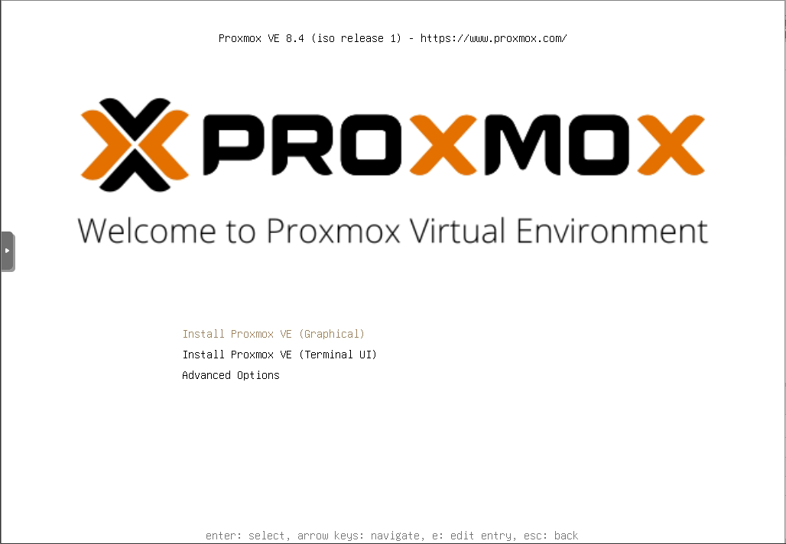

🔸 A continuació, acceptem la **llicència d’ús** del programari.


🔸 En el següent pas, seleccionem en quin disc volem instal·lar Proxmox. En este exemple només tenim un disc disponible, així que el seleccionem. També podem configurar el sistema de fitxers. Triem **ext4**.

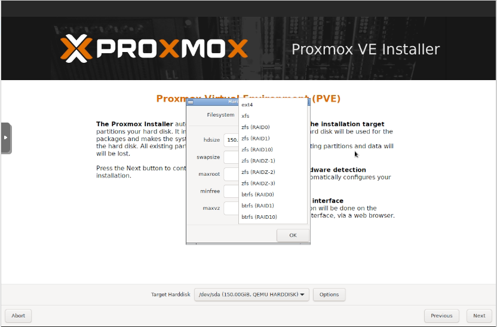

🔸 Assignem la totalitat de l’espai disponible al disc, ja que només n'hi ha un.

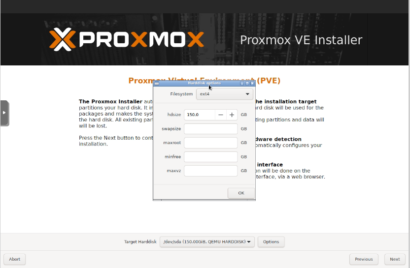

🔸 Configurem la **zona horària**.

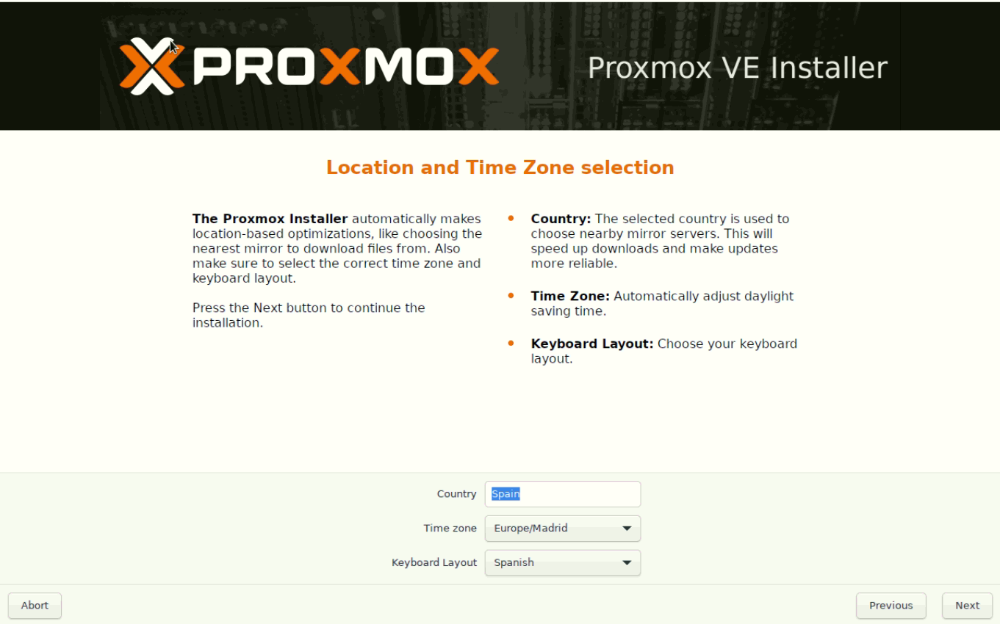
🔸 Introduïm la **contrasenya d’administració** i un **correu electrònic** per a notificacions del sistema.


🔸 Assignem el **nom del *host***, la **IP**, el **gateway** i els **DNS**.

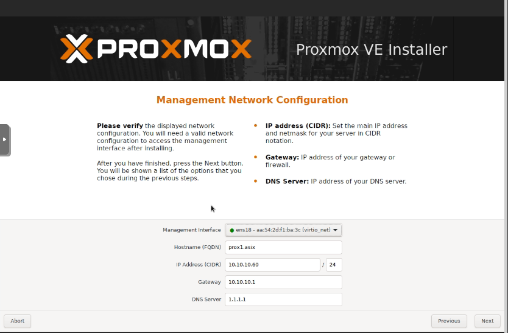

🔸 Finalment, es mostra un **resum de la configuració** triada. Confirmem i iniciem la instal·lació.

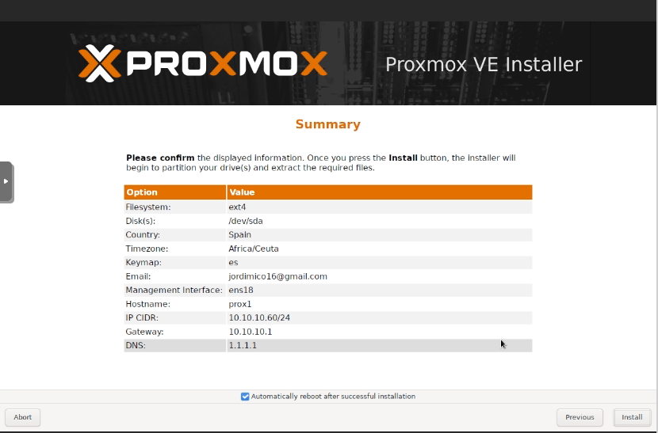

🔸 Un cop finalitzada la instal·lació, a la consola apareixerà un missatge indicant que podem accedir a la interfície web de Proxmox via:

```
https://10.10.10.60:8006
```


🔸 Així accedim a la **interfície web de Proxmox VE**:

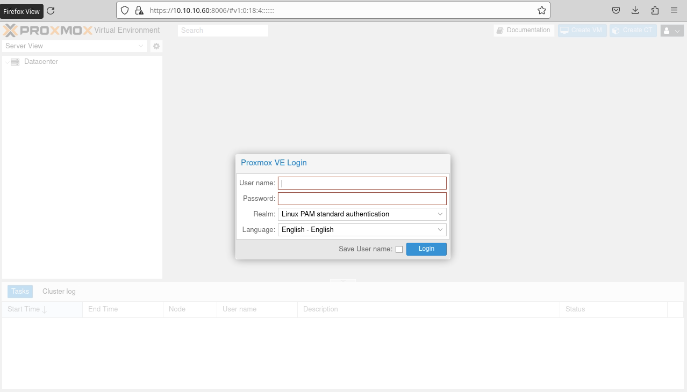

---

### 🖥️ Instal·lació del Node 2

El procés d’instal·lació del **segon node** és **idèntic** al del primer, excepte pels valors del **nom del host** i la **IP**, que han de ser únics per a cada node.

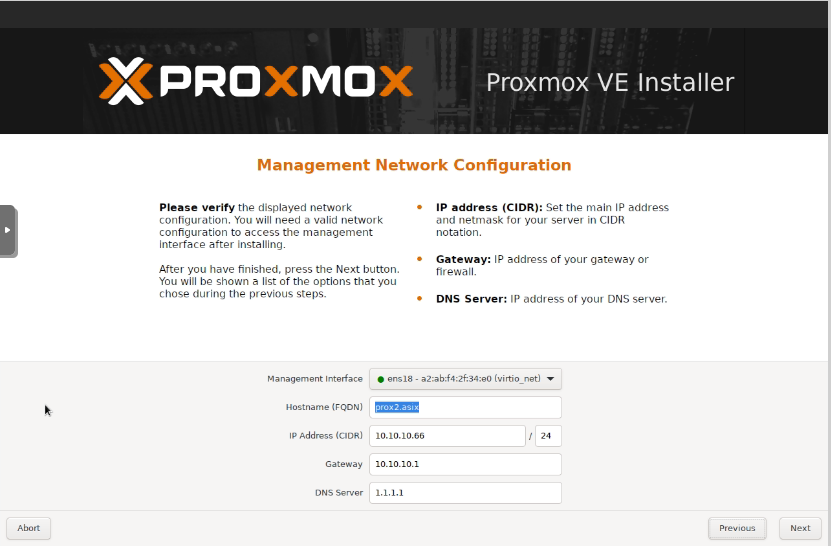

Com es pot comprovar en el resum, l’única diferència és la IP i el nom del host.

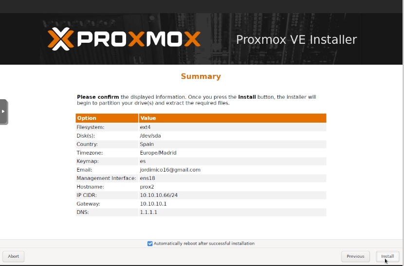

Després de completar la instal·lació, tornem a tindre accés a la interfície web per la nova IP configurada:

```
https://10.10.10.61:8006
```

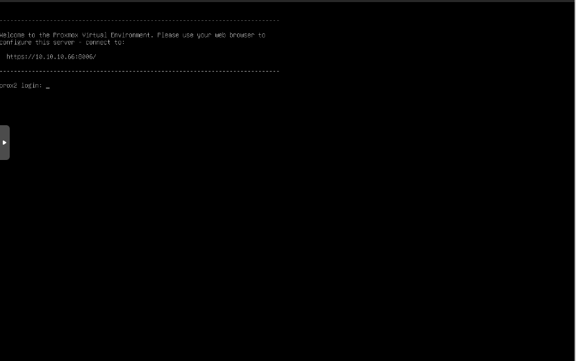

I amb això, accedim de nou a la interfície de gestió de Proxmox:

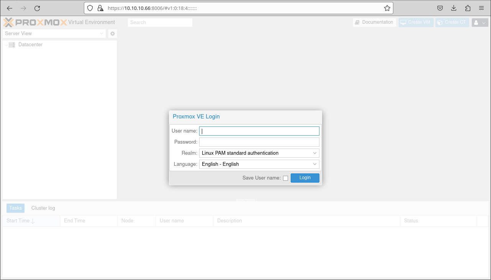

---

### 🖥️ Instal·lació del Node 3

El procés d’instal·lació del **segon node** és **idèntic** al del primer, excepte pels valors del **nom del host** i la **IP**, que han de ser únics per a cada node.

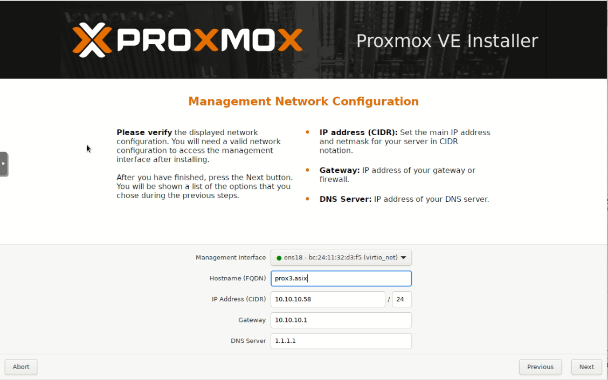

Com es pot comprovar en el resum, l’única diferència és la IP i el nom del host.

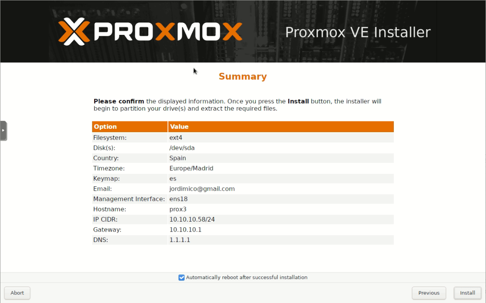

Després de completar la instal·lació, tornem a tindre accés a la interfície web per la nova IP configurada:

```
https://10.10.10.58:8006
```

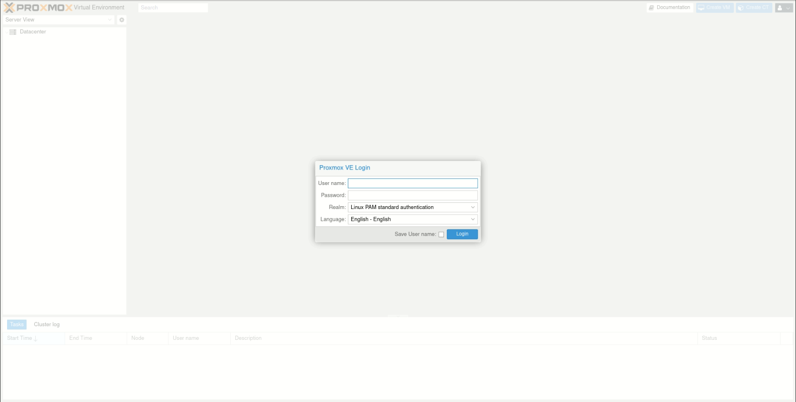

I amb això, accedim de nou a la interfície de gestió de Proxmox:

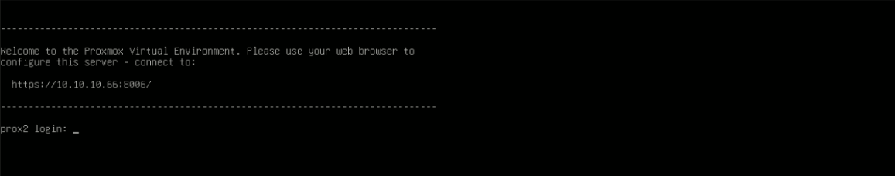
