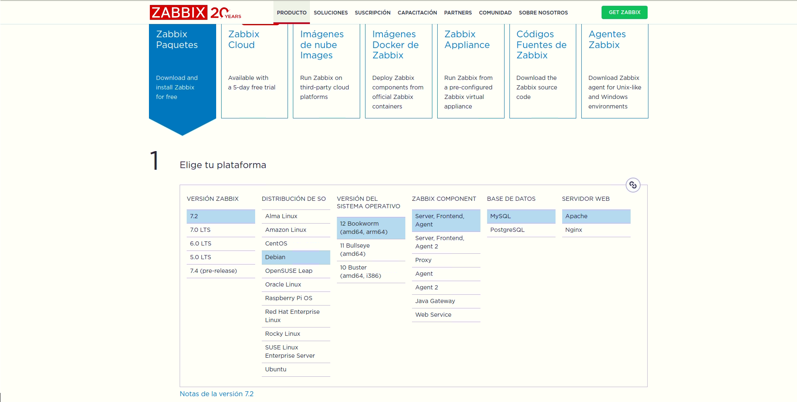
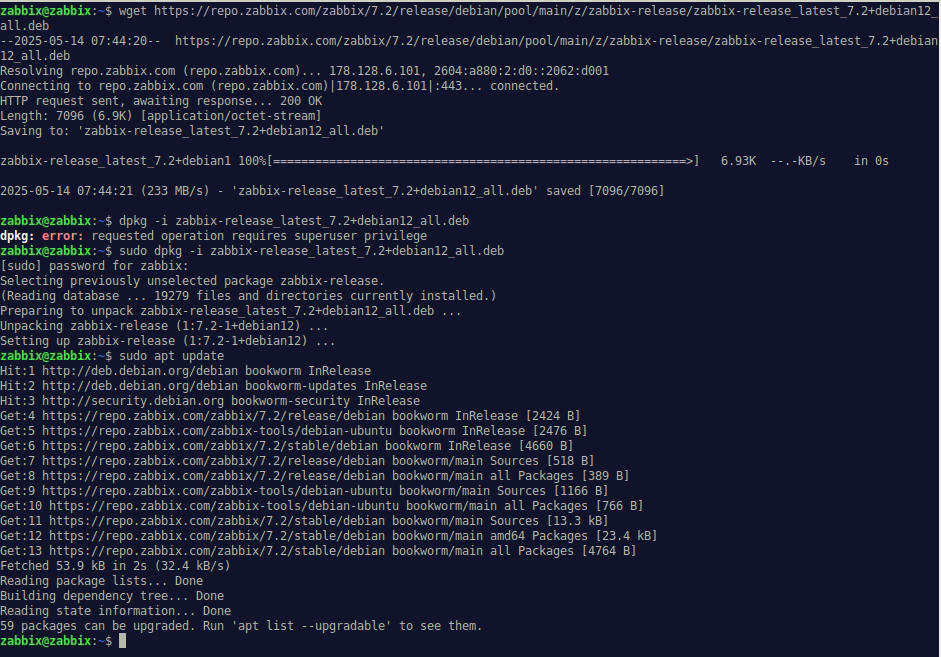
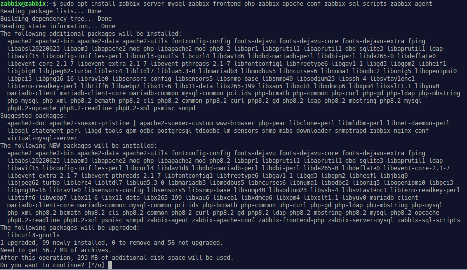
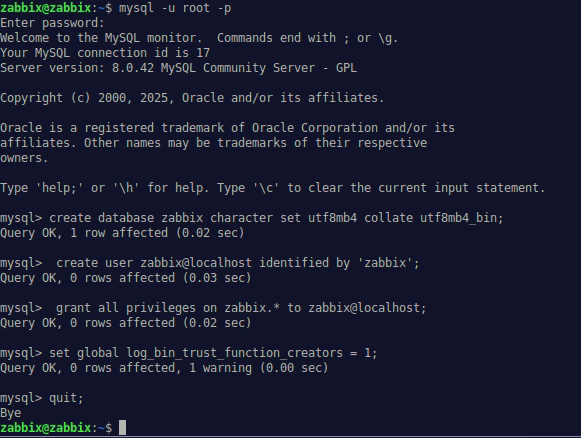
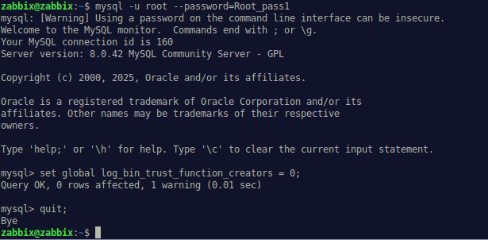
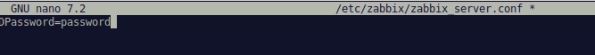
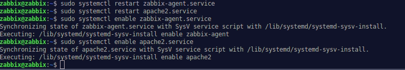
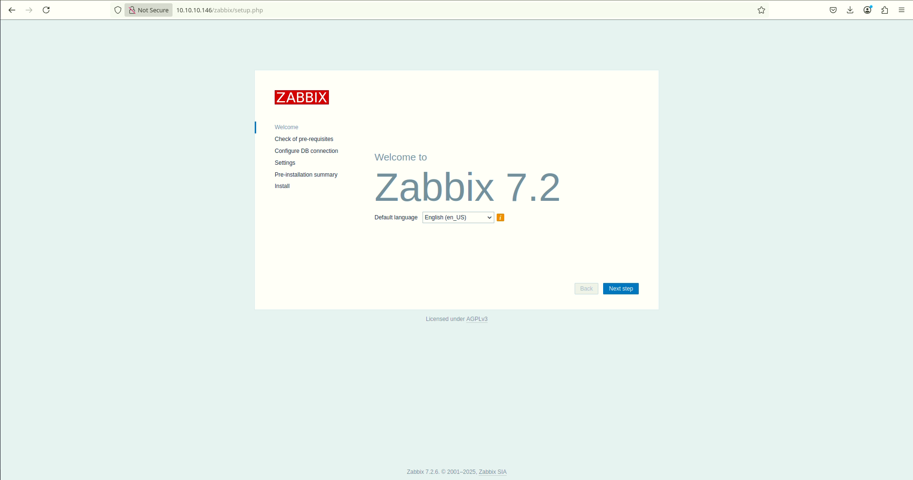

## 9. 📊 Monitoratge Centralitzat amb **Zabbix**

### 1. Descàrrega de Zabbix

Per començar, accedim a la web oficial de Zabbix: [https://www.zabbix.com](https://www.zabbix.com)

Una vegada dins, cal anar a l’apartat **Download Zabbix**, on seleccionarem:

* La **versió** desitjada (en aquest cas, la 7.2)
* El **sistema operatiu** (Debian 12)
* Els **components** (servidor, frontend, agent)
* El tipus de **base de dades** (MySQL/MariaDB)
* El servidor web (Apache)

> 

---

### 2. Instal·lació i configuració del servidor Zabbix

#### a. Instal·lació del repositori oficial

```bash
wget https://repo.zabbix.com/zabbix/7.2/release/debian/pool/main/z/zabbix-release/zabbix-release_latest_7.2+debian12_all.deb
dpkg -i zabbix-release_latest_7.2+debian12_all.deb
apt update
```

> 

---

#### b. Instal·lació dels paquets principals

Instal·lem el servidor Zabbix, el frontend web amb Apache, els scripts SQL i l’agent:

```bash
apt install zabbix-server-mysql zabbix-frontend-php zabbix-apache-conf zabbix-sql-scripts zabbix-agent
```

> 

---

#### c. Creació de la base de dades

Assegura’t que el servidor de bases de dades (MariaDB o MySQL) està operatiu.

Accedim al client de MySQL per crear la base de dades i l’usuari:

```bash
mysql -uroot -p
```

```sql
CREATE DATABASE zabbix CHARACTER SET utf8mb4 COLLATE utf8mb4_bin;
CREATE USER zabbix@localhost IDENTIFIED BY 'password';
GRANT ALL PRIVILEGES ON zabbix.* TO zabbix@localhost;
SET GLOBAL log_bin_trust_function_creators = 1;
QUIT;
```

> 

---

#### d. Importació de l’esquema de dades

Des del servidor Zabbix, importem l’esquema i les dades inicials:

```bash
zcat /usr/share/zabbix/sql-scripts/mysql/server.sql.gz | mysql --default-character-set=utf8mb4 -uzabbix -p zabbix
```

> 

Després, restaurem el valor per defecte de la directiva `log_bin_trust_function_creators`:

```bash
mysql -uroot -p
```

```sql
SET GLOBAL log_bin_trust_function_creators = 0;
QUIT;
```

> 

---

#### e. Configuració del servidor Zabbix

Editem el fitxer de configuració del servidor `/etc/zabbix/zabbix_server.conf` i establim la contrasenya de la base de dades:

```bash
DBPassword=password
```

> 

---

#### f. Inici dels serveis

Reiniciem els serveis necessaris i els activem perquè s’inicien automàticament amb el sistema:

```bash
systemctl restart zabbix-server zabbix-agent apache2
systemctl enable zabbix-server zabbix-agent apache2
```

> 

---

#### g. Accés a la interfície web

Una vegada tot estiga operatiu, podem accedir a la interfície web de Zabbix des del navegador:

```
http://IP_DEL_SERVIDOR/zabbix
```

Des d’ací podrem finalitzar la configuració via web GUI.

> 

---

Amb això, el servidor Zabbix queda instal·lat i llest per a ser utilitzat per a la monitorització centralitzada de la infraestructura.

> 